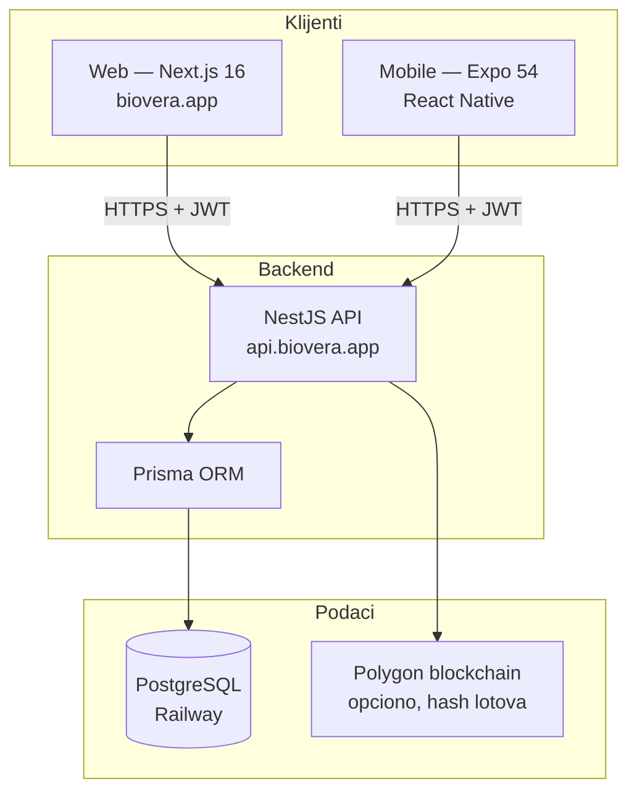
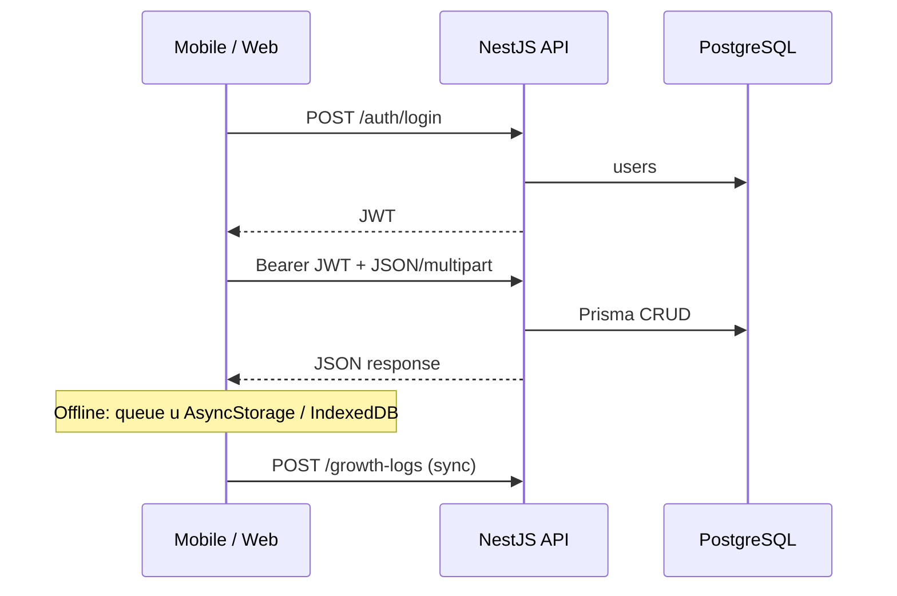

# Bio Vera — arhitektura sistema (as-built)

**Ažurirano:** 2026-05-30  
**Repo:** `veraagrar` (monorepo)  
**Produkcija:** [biovera.app](https://biovera.app) · API [api.biovera.app](https://api.biovera.app)

Ovaj dokument opisuje **stvarno stanje koda** — kako su povezani backend, web, mobilna aplikacija, baza i blockchain. Za detalje po temi vidi linkove na kraju.

---

## 1. Pregled ekosistema

Bio Vera je **vertikalni lanac** od semena do retaila u Hamburgu, sa digitalnim pasošom, compliance proverama i finansijskim splitom.



### Četiri stuba (poslovna logika)

| Stub | Šta pokriva | Gde živi |
|------|-------------|----------|
| **Vertikalni lanac** | Seme → osiguranje → gajenje → pakovanje → logistika → retail | `batches`, `missions`, `material-control`, `payments` |
| **Tehnički standard** | Offline-first, barcode/GPS integrity, anti-fraud | `growth-logs`, `field-entries`, `integrity-guard`, mobile `sync-service` |
| **Transparentnost** | QR pasoš, farmer profil, mapa, cold chain | `farmer-profile`, `digital-passports`, `qr`, `vera-transparency` |
| **Finansije** | Escrow, split, seed margin, Vera bonus | `payments`, `wallets`, `financial-dashboard`, `vera-bonus` |

---

## 2. Struktura monorepo-a

```
veraagrar/
├── backend/          NestJS API + Prisma + migracije
├── web/              Next.js App Router (Vercel)
├── mobile/           Expo Router (EAS build)
├── shared/           Deljeni TypeScript (delimično korišćen)
├── blockchain/       Hardhat + BioVeraTrace.sol
├── docs/             Specifikacije i planovi (ovaj fajl + ostali)
├── scripts/          Alati (i18n, UI copy map)
└── package.json      parity:typecheck, parity:backend
```

| Paket | Tehnologija | Deploy |
|-------|-------------|--------|
| **backend** | NestJS 10, Prisma, PostgreSQL | **Railway** (`backend/railway.json`, Docker) |
| **web** | Next.js 16, React, Tailwind | **Vercel** (`output: standalone`) |
| **mobile** | Expo 54, Expo Router, NativeWind | **EAS** (`mobile/eas.json`) |
| **shared** | TypeScript (`@biovera/shared`) | Nije npm workspace — relativni importi |

**Baza:** PostgreSQL na **Railway** (`DATABASE_URL` u backend env). Nije Supabase u produkciji (Supabase se pominje samo u starijoj dokumentaciji).

---

## 3. Backend (NestJS)

### Ulazna tačka

- `backend/src/main.ts` — port `3000`, CORS za `biovera.app` / Vercel preview
- Na startu: `prisma migrate deploy` (osim `ALLOW_START_WITHOUT_MIGRATE=true`)

### Moduli (grupisano po domenu)

| Domen | Moduli (primeri) |
|-------|------------------|
| **Auth** | `auth`, `users`, `kyc` |
| **Njiva** | `estates`, `parcels`, `seeds`, `growth-logs`, `field-entries`, `plot-mapper`, `harvest-announcements`, `growers`, `farmer-profile` |
| **Compliance** | `material-control`, `compliance`, `integrity-guard`, `haccp`, `quality-entry`, `anti-fraud` |
| **Lanac** | `batches`, `inventory`, `missions`, `deliveries`, `digital-handover`, `temperature`, `package-badges` |
| **Trgovina** | `orders`, `payments`, `buyers`, `b2b-suppliers`, `suppliers` |
| **Finansije** | `wallets`, `financial-dashboard`, `invoices`, `vera-bonus`, `market-prices` |
| **Transparentnost** | `qr`, `digital-passports`, `batch-history`, `blockchain`, `vera-transparency` |
| **Admin** | `admin`, `command-control`, `operations`, `audit-trail`, `notifications` |
| **Sync** | `sync`, `group-sync` |

Puna lista: `backend/src/app.module.ts` (~76 modula).

### Baza (Prisma)

- **Schema:** `backend/prisma/schema.prisma` (~68 modela)
- **Konvencija:** snake_case tabele (`users`, `growth_logs`, `compliance_photos`, `batches`)
- **Ključni modeli:** `users`, `estates`, `parcels`, `batches`, `orders`, `missions`, `payments`, `wallets`, `growth_logs`, `compliance_photos`, `bio_white_list`

### Autentifikacija

```
POST /auth/login          → JWT
POST /auth/register/grower
POST /auth/register/buyer
Authorization: Bearer <token>
```

- Payload: `sub`, `partnerCode`, `roles[]`
- Guardi: `JwtAuthGuard`, `RolesGuard`, `@Roles('GROWER', 'ADMIN', …)`
- Nema refresh tokena — 401 → klijent briše sesiju

### Primeri REST putanja (grower)

| Akcija | Ruta |
|--------|------|
| Njive | `GET/POST /estates` |
| Dnevnik rasta | `GET /growth-logs/estate/:id`, `POST /growth-logs` |
| Lotovi | `GET/POST /batches` |
| Compliance foto | `POST /material-control/compliance-photos` |
| Javni farmer profil | `GET /farmer-profile/qr/:qrCode` |
| Novčanik | `GET /wallets/me` |
| Offline sync | `POST /sync/field-entries` |

---

## 4. Web (Next.js)

### Struktura ruta (`web/app/`)

| Uloga | Put | Namena |
|-------|-----|--------|
| **Grower** | `/grower/*` | Dashboard, batches, missions, materials, field-diary, compliance-photos, portal |
| **Admin** | `/admin/*` | grower-control, estates, HACCP, finance, field-blockchain |
| **Buyer** | `/buyer-portal/*` | Dashboard, orders, deliveries, invoices |
| **Supplier** | `/supplier/*` | Orders, catalog, messages |
| **Logistics** | `/logistics-partner/*` | Missions, handover, vehicles |
| **Javno** | `/farmer/[qrCode]`, `/passport/[batchId]`, `/verify/[batchId]` | Pasoš, farmer profil |
| **Marketing** | `/[locale]/*` | Landing, investor, careers |

Legacy redirecti: `web/next.config.ts` (npr. `/buyer/*` → `/buyer-portal/*`, `/producer/dashboard` → `/grower`).

### API klijent

- **Monolit:** `web/lib/api.ts` (~2200 linija) — axios + ~40 API objekata
- **Base URL:** `web/lib/api-base.ts` → `NEXT_PUBLIC_API_URL` ili `https://api.biovera.app`
- **Sesija:** `localStorage` — `token`, `user`
- **Offline:** `web/lib/offline/indexeddb.ts` + `sync.ts` (grower field entries)
- **Realtime:** `web/hooks/useNotificationSocket.ts` — Socket.IO `/notifications`

### Grower web vs mobile (namena)

| Web (desk) | Mobile (teren) |
|------------|----------------|
| Admin pregled, finance, grower-control | GPS, kamera, skener, offline queue |
| Compliance upload sa desktopa | Field log, growth journal, harvest wizard |
| Sidebar navigacija | 5 hub tabova + stack workflow |

---

## 5. Mobilna aplikacija (Expo)

### Enterprise Design System (EDS)

Mobilni grower UI ide kroz **`mobile/design-system/`** — React komponente sa web paritetom:

| Komponenta | Web paritet |
|------------|-------------|
| `EnterpriseButton` | `PremiumButton` |
| `EnterpriseTextField` | grower input |
| `EnterprisePanel` | `PremiumCard` |
| `EnterprisePageTitle` | `PremiumPageTitle` |
| `EnterpriseNavSection` | workflow tiles |
| `GrowerTabScaffold` | `GrowerPageShell` + canvas |

Tokeni: `shared/design/tokens.ts` · Dokumentacija: `mobile/docs/MOBILE_ARCHITECTURE.md`

### Router (`mobile/app/`)

| Grupa | Prefix | Uloge |
|-------|--------|-------|
| **Producer/Grower** | `(producer)/` | `ADMIN`, `FARMER`, `PARTNER`, `GROWER` |
| **Buyer** | `(buyer)/` | `BUYER`, `CUSTOMER` |
| **Logistics** | `(logistics)/` | Vozač / partner |
| **Supplier** | `(supplier)/` | `MATERIAL_SUPPLIER` |
| **Global** | root | `login`, `map`, `scan-qr`, `product/[id]` |

### Grower — 5 tabova + stack

Donji meni (`mobile/app/(producer)/(tabs)/_layout.tsx`):

| Tab | Ruta | Hub ekran |
|-----|------|-----------|
| Početna | `(tabs)/index` | `features/grower/dashboard/DashboardScreen` |
| Polje | `(tabs)/field` | `features/grower/hubs/FieldHubScreen` |
| Lanac | `(tabs)/chain` | `features/grower/hubs/ChainHubScreen` |
| Nabavka | `(tabs)/supplies` | `features/grower/hubs/SuppliesHubScreen` |
| Profil | `(tabs)/profile` | `features/grower/profile/ProducerProfileScreen` |

Skriveni tabovi (`href: null`): `field-log`, `harvest`, `products`, `wallet`, `settings`, … — otvaraju se iz hub kartica.

**Mapa navigacije:** `mobile/docs/GROWER_NAV.md`

### Slojevi koda (mobile)

```
app/(producer)/*.tsx     → tanak wrapper (1–5 linija)
features/grower/**       → ekrani, forme, hookovi (poslovna logika)
components/**            → deljena UI (enterprise, grower, map)
contexts/**              → Auth, Network, Wallet, GrowerDashboard
lib/api/**               → axios moduli po domenu
lib/sync-service.ts      → offline queue → API
i18n/locales/sr.json     → default jezik
```

### Provider lanac (grower)

```
AuthGuard
  └── NetworkProvider
        └── WalletProvider          ← GET /wallets/me (jednom)
              └── GrowerDashboardProvider
```

Root (`app/_layout.tsx`): `AuthProvider`, `CartProvider`, `syncService` startup.

### API klijent (mobile)

- **Modularno:** `mobile/lib/api/` — `auth`, `estates`, `batches`, `orders`, `grower`, `buyer`, …
- **URL:** `EXPO_PUBLIC_API_URL` → `https://api.biovera.app` (`mobile/lib/api-url.ts`)
- **Sesija:** AsyncStorage — `auth_token`, `auth_user`

### Offline-first

| Komponenta | Fajl | Ponašanje |
|------------|------|-----------|
| Lokalni queue | `lib/offline-storage.ts` | AsyncStorage — field entries, planovi, troškovi |
| Sync | `lib/sync-service.ts` | `POST /growth-logs` kad ima mreže |
| UI | `ProducerOfflineStrip`, `GrowerReconnectAutoSync` | Indikator + auto sync |
| Integritet | `lib/integrity-guard.ts` | Barcode / GPS pre slanja |

---

## 6. Paket `shared/`

**Lokacija:** `shared/` · **Naziv:** `@biovera/shared`

| Export | Namena | Ko koristi |
|--------|--------|------------|
| `lib/grower-journey.ts` | 12 koraka sezone (web + mobile putanje) | **Mobile** (`mobile/lib/grower-journey-data.ts`) |
| `services/phi-validation.service.ts` | PHI / waiting period | **Niko** (još) |
| `services/payout-calculation.service.ts` | Isplata farmeru | **Niko** (još) |
| `services/globalgap-validation.service.ts` | GlobalG.A.P. | **Niko** (još) |
| `lib/backend-service.ts` | Generički fetch klijent | **Niko** (još) |

**Web ne importuje `shared/`** — dupliranje grower journey i poslovnih pravila.

---

## 7. Tok podataka (web + mobile → backend)



### Javni farmer profil — odakle slike

`GET /farmer-profile/qr/:qrCode` → `photos`:

| Polje | Izvor u bazi | Napomena |
|-------|--------------|----------|
| `photos.profile` | `users.farmerPhoto` | Profilna slika |
| `photos.field` | `compliance_photos` (lotovi farmera) | Pakovanje / compliance |
| `photos.growth` | `growth_logs.imageUrl` | Dnevnik rasta |

Admin **Progress photos** (`/admin/grower-control`) prikazuje growth log; **compliance** zahteva filter po partner kodu + novi admin endpoint (`/material-control/admin/compliance-photos`).

---

## 8. Blockchain

| Sloj | Put |
|------|-----|
| Smart contract | `blockchain/files/contracts/BioVeraTrace.sol` |
| Backend servis | `backend/src/blockchain/blockchain.service.ts` |
| API | `POST/GET /api/blockchain/*` |
| DB veza | `batches.blockchainTxHash` |

**Uloga:** hash metapodataka lota na Polygon (opciono — isključeno ako nema env). **Ne čuva** slike sa profila farmera.

Growth log „immutable hash“ (`dataHash`, `previousLogHash`) je **lanac u PostgreSQL**, ne on-chain.

---

## 9. Deploy i okruženje

| Servis | Platforma | Ključne env varijable |
|--------|-----------|----------------------|
| API | Railway | `DATABASE_URL`, `JWT_SECRET`, `PORT`, `RAILWAY_PUBLIC_DOMAIN` |
| Web | Vercel | `NEXT_PUBLIC_API_URL`, `NEXT_PUBLIC_SITE_URL` |
| Mobile build | EAS | `EXPO_PUBLIC_API_URL`, `EXPO_PUBLIC_SITE_URL` |
| DB | Railway Postgres | connection string u Railway dashboard |

**Lokalni dev:**

```bash
# Backend
cd backend && npm run start:dev

# Web
cd web && npm run dev

# Mobile
cd mobile && npx expo start

# Parity typecheck (root)
npm run parity:typecheck
```

---

## 10. Kako su web i mobile povezani (i gde nisu)

### Povezano (dobro)

- **Isti API** i ista baza za sve uloge
- **Isti poslovni entiteti** (lot, misija, wallet, compliance)
- **Grower journey definicije** — delimično u `shared/lib/grower-journey.ts`
- **i18n ključevi** — paralelno `web/locales` i `mobile/i18n/locales`
- **Dizajn tokeni** — Bio Vera zelena `#2D5A27`, enterprise UI pravila

### Nije dovoljno povezano (tehnički dug)

| Problem | Posledica |
|---------|-----------|
| Dva API klijenta | `web/lib/api.ts` vs `mobile/lib/api/*` — duplirani endpointi, lako desinhronizovati |
| `shared/` neiskorišćen | PHI, payout, validacije nisu jedinstvene |
| Različite rute | Web `/grower/field-diary` vs mobile `growth-journal` |
| Paritet ekrana | Npr. brisanje slika — admin web, ne grower mobile |
| Session storage | `localStorage` vs AsyncStorage — različiti ključevi |
| Nema npm workspaces | Paketi povezani relativnim putanjama |

**Zaključak:** Arhitektura **jeste povezana preko backend-a**, ali **frontovi nisu jedan produkt** — dva odvojena klijenta sa delimičnim paritetom.

---

## 11. Preporučeni smer (bez Flutter rewrite-a)

Flutter **ne rešava** web/mobile dupliranje — i dalje bi imali Next.js + Flutter + isti API.

| Prioritet | Akcija |
|-----------|--------|
| **P0** | Parity matrica po grower flow-u (web ruta ↔ mobile ruta ↔ API) |
| **P1** | Proširiti `shared/` — tipovi, enumi, validacije |
| **P2** | Zatvoriti feature gapove (delete photos, admin compliance UI deploy) |
| **P3** | Stabilizovati mobile IA — **ne** novi refactor tabova |
| **P4** | Opciono: `@biovera/api-client` paket koji web i mobile dele |

Detaljan plan pariteta: `docs/WEB_MOBILE_CHANNEL_PARITY_PLAN.md`

---

## 12. Uloge i površine

| Uloga | Web | Mobile | Admin |
|-------|-----|--------|-------|
| **Grower** | `/grower/*` | `(producer)/*` | `/admin/grower-control`, `/admin/users` |
| **Buyer** | `/buyer-portal/*` | `(buyer)/*` | — |
| **Logistics** | `/logistics-partner/*` | `(logistics)/*` | `/admin/missions` |
| **Supplier** | `/supplier/*` | `(supplier)/*` | — |
| **Javnost** | `/farmer/[qr]`, `/passport/*` | `scan-qr`, `product/[id]` | — |

---

## 13. CI / kvalitet

- **GitHub Actions:** `.github/workflows/ci.yml`
- **Path filter:** web / mobile / backend odvojeno
- **Root skripte:** `npm run parity:typecheck`, `npm run parity:backend`
- **Pravilo:** `npx tsc --noEmit` u `web/`, `mobile/`, `backend/` pre merge-a

---

## 14. Povezana dokumentacija

| Dokument | Sadržaj |
|----------|---------|
| [GROWER_NAV.md](../mobile/docs/GROWER_NAV.md) | Mobile grower navigacija (5 tabova, workflow) |
| [GROWER_IA_WORK_PLAN.md](../mobile/docs/GROWER_IA_WORK_PLAN.md) | IA refactor plan (faze) |
| [WEB_MOBILE_CHANNEL_PARITY_PLAN.md](./WEB_MOBILE_CHANNEL_PARITY_PLAN.md) | Paritet web ↔ mobile |
| [GROWER_WEB_MOBILE_PRIORITY_PLAN.md](./GROWER_WEB_MOBILE_PRIORITY_PLAN.md) | Prioriteti grower flow-a |
| [BIO_VERA_OPERATIONAL_ARCHITECTURE.md](./BIO_VERA_OPERATIONAL_ARCHITECTURE.md) | HACCP / legal stubovi |
| [BIO_VERA_MASTER_ARCHITECTURE.md](./BIO_VERA_MASTER_ARCHITECTURE.md) | Plan realizacije (offline, anti-fraud) |
| [BLOCKCHAIN_SETUP.md](./BLOCKCHAIN_SETUP.md) | Polygon / Hardhat |
| [MOBILE_SCROLL_BUDGET.md](../mobile/docs/MOBILE_SCROLL_BUDGET.md) | Mobile UI scroll pravila |
| `.cursorrules` | Master system prompt (4 stuba) |

---

## 15. Brza referenca — ključni fajlovi

```
backend/src/app.module.ts
backend/src/main.ts
backend/prisma/schema.prisma
web/lib/api.ts
web/lib/api-base.ts
web/app/grower/
web/app/admin/
mobile/app/(producer)/_layout.tsx
mobile/app/(producer)/(tabs)/_layout.tsx
mobile/features/grower/
mobile/lib/api/index.ts
mobile/lib/sync-service.ts
shared/lib/grower-journey.ts
docs/WEB_MOBILE_CHANNEL_PARITY_PLAN.md
```

---

*Za izmene ove arhitekture: ažuriraj ovaj fajl kada menjaš deploy target, broj tabova, ili centralni API ugovor.*
