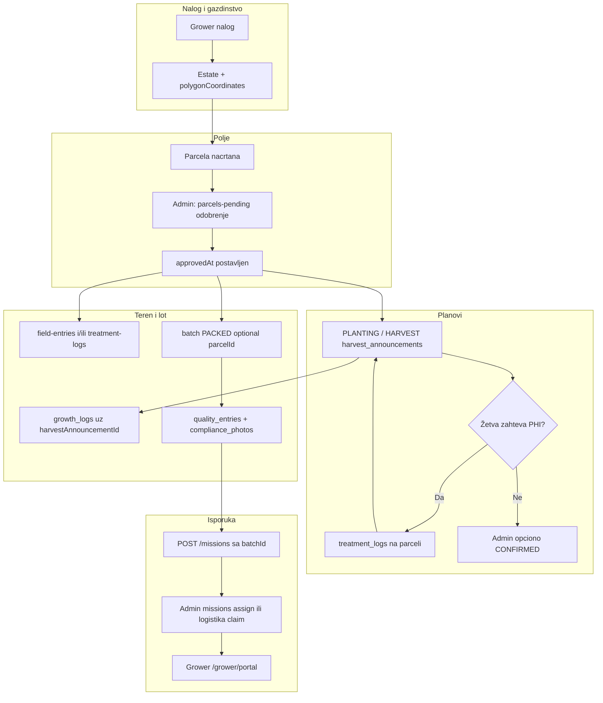

# Grower tokovi: preduslovi, šta gde postoji, šta druga strana očekuje

Ovaj fajl je **istraživačka mapa** repoa: koji korak sme da se uradi tek kad šta već postoji na serveru ili u drugom UI-ju. Koristi ga pri dizajnu ekrana, copy-ja za prazna stanja i pri proveri **web ↔ mobilni ↔ admin** pariteta.

**Povezani planovi:** [`WEB_MOBILE_CHANNEL_PARITY_PLAN.md`](WEB_MOBILE_CHANNEL_PARITY_PLAN.md) · [`GROWER_WEB_MOBILE_PRIORITY_PLAN.md`](GROWER_WEB_MOBILE_PRIORITY_PLAN.md)

**Legenda**

- **Preduslov** — entitet ili akcija koja mora postojati pre nego što API prihvati zahtev (inace 400/403/404).
- **Gde se unosi** — tipična površina u ovom monorepu (`web/app/grower/*`, `mobile/app/(producer)/*`, admin panel).
- **Rizik pariteta** — kada jedna strana šalje podatak koji druga ne prikuplja ili obrnuto.

---

## 1. Osnovna hijerarhija podataka (Blueprint)

```
User (GROWER/FARMER)
  → Estate (farmId / estateId)
      → Parcel (parcela, polygon, status, approvedAt)
          → harvest_announcements (PLANTING | HARVEST plan, parcelId)
              → growth_logs (parcel + harvestAnnouncementId)
      → batches (opciono parcelId; lot)
          → quality_entries (1:1 batch)
          → compliance_photos (batch)
          → missions / transport (batch)
```

**Centralno pravilo:** mnogi „poljski“ API-ji zahtevaju **`parcel.approvedAt`** (admin je odobrio parcelu) ili ekvivalent (`status` ACTIVE/CERTIFIED za planove u kodu). Bez toga grower dobija **403** tipa *parcel is not approved yet*.

---

## 1b. GPS: transport vs. materijali / dnevnik (česta zabuna)

| Tok | Da li moraš biti fizički na parceli? | Šta API zapravo proverava |
|-----|--------------------------------------|---------------------------|
| **Zakazivanje transporta** (`POST /missions`) | **Ne.** Možeš poslati bilo koje **validne** geografske koordinate (npr. tačka preuzimanja na farmi) i tekst adrese. | Samo da su `lat`/`lng` brojevi u dozvoljenom opsegu. **Nema** provere „unutar poligona parcele“. (Ruta za dispečere i dalje koristi te koordinate za daljinu do partnera ako je auto-dodela uključena.) |
| **Mobilni „Dnevnik polja”** (fotka + GPS → sinhronizacija na `POST /field-entries`) | **Da**, u smislu: tačka koju telefon šalje mora da upadne u **crtani oblik** (polygon) gazdinstva ili neke parcele tog gazdinstva (+ tolerancija GPS greške, `GPS_BOUNDARY_TOLERANCE_METERS` + tačnost uređaja). | **Ne** gleda se adresa koju si uneo kao napomenu ili „test adresa“ na kartici — gledaju se **isključivo** `polygonCoordinates` iz baze. Ako je poligon farme negde u jednoj zemlji, a GPS telefona u drugoj, dobijaš odbijanje i ako „misliš“ da je parcela „kod kuće“. |
| **Tretman / potrošnja materijala na parceli** (`POST /treatment-logs`) | Isto kao integritet polja: GPS unutar poligona **parcele** (ili poligona gazdinstva ako parcele nema) uz istu ideju tolerancije. | Koristi `GeometryUtil.polygonFromJson` + traku uz ivicu poligona (usklađeno sa field-entries). |

**Zašto „napravio sam test parcelu kod stana“ ipak baca grešku:** aplikacija šalje **trenutnu GPS poziciju** telefona. To **nije** tekst adrese parcele. Ako si u stanovu ali GPS (ili emulator) i dalje pokazuje drugu tačku, ili je poligon parcele nacrtan tako da ta tačka ne upada u zatvoreni oblik, validacija neće proći. Rešenje: nacrtaj poligon tako da **stvarno** obuhvata tačku koju vidiš kad u aplikaciji uhvatiš lokaciju, ili probaj na farmi; za lokalno testiranje admin/backend može privremeni `FIELD_ENTRY_RELAX_GPS` (samo staging).

### 1c. Bočni tok posle žetve (harvest plan → misija)

Kada grower pošalje **HARVEST** plan (`POST /harvest-announcements`), backend **pokušava** da otvori **PENDING** (ili ASSIGNED ako je uključena auto-dodela) **misiju** vezanu za taj plan (`createMissionFromHarvestAnnouncement`). Preduslov za uspeh te sporedne misije: **gazdinstvo** mora imati validan **`polygonCoordinates`** ( centroid preuzimanja ); ako nema, plan berbe se **ipak čuva**, ali misija iz plana može biti preskočena (log na API-ju). To **nije** isto što i transport sa **batch**-om (nakon pakovanja).

---

## 1d. Admin i operativa (šta mora uraditi druga strana)

| Akcija | Gde (tipično) | Šta groweru omogućava |
|--------|----------------|------------------------|
| Odobrenje parcele (`approvedAt`) | Admin panel — pending parcele (`parcels.service` / `approve`) | Zasad, žetva, tretman, batch sa `parcelId`, growth journal, većina poljskih validacija |
| Potvrda plana žetve (`harvest_announcements.status = CONFIRMED`) | Admin — harvest plans | Opciono obavezno pre **transporta sa lotom** ako je `MISSIONS_REQUIRE_CONFIRMED_HARVEST_PLAN=true` |
| Bela lista (`bio_white_list`) + aktivni proizvod | Admin / compliance | Skeniranje materijala, tretmani (`productId`), dio compliance provera |
| `bio_vera_standards` (foto tipovi) | Admin — material control standard | Blokada isporuke ako nedostaju compliance fotografije za batch |
| Dodela logistike na PENDING misiju | Admin `PATCH missions/admin/:id/assign` ili logističar claim | Grower vidi dodelu u portalu / misiji |

Bez odobrene parcele grower često vidi **403** sa jasnim tekstom; bez CONFIRMED žetve (kad je env uključen) transport sa batch-om dobija **400** sa objašnjenjem.

---

## 1e. Environment varijable (usklađivanje ponašanja)

| Promenljiva | Uticaj na grower tok |
|-------------|----------------------|
| `MISSIONS_REQUIRE_CONFIRMED_HARVEST_PLAN` | Ako `true`, `POST /missions` traži potvrđen berba plan za parcelu batch-a (gdje primenjivo). |
| `MISSIONS_AUTO_ASSIGN_LOGISTICS_PARTNER` | Ako `true`, nova misija može odmah dobiti dodeljenog partnera/vozilo. |
| `GPS_BOUNDARY_TOLERANCE_METERS` | Bazna tolerancija (m) za **field-entries** i **treatment-logs** (proširuje se sa `accuracy` uređaja). |
| `FIELD_ENTRY_RELAX_GPS` | Samo dev/staging: preskače granicu za `field-entries` (**ne** u produkciji). |
| `BLOB_READ_WRITE_TOKEN` | Fotografije predaja / handover idu na Blob umesto velikog base64 u DB. |

Izvor: `backend/src/field-entries/field-entries.service.ts`, `backend/src/missions/missions.service.ts`, `backend/src/quality-entry/*`.

---

## 1f. Admin web (`web/app/admin/*`) — šta otključava grower tok

Sidebar definisan u `web/lib/admin-nav.tsx`. Ispod su rute **najrelevantnije** za preduslove iz ovog dokumenta (ne kompletan admin SaaS opis).

| Admin URL | Stranica / fajl | Posao operativa | Šta grower dobija nakon toga |
|-----------|-----------------|-----------------|-------------------------------|
| `/admin` | `app/admin/page.tsx` | Pregled brojki; CTA ka parcelama i planovima | — |
| `/admin/parcels-pending` | `app/admin/parcels-pending/page.tsx` | Odobravanje parcele (`PUT /parcels/:id/approve`) | `approvedAt` → zasad, žetva, tretman, većina poljskih API-ja |
| `/admin/harvest-plans` | `app/admin/harvest-plans/page.tsx` | Potvrda plana (`PATCH …/admin/:id`, status **CONFIRMED**) | Ako je `MISSIONS_REQUIRE_CONFIRMED_HARVEST_PLAN=true`, grower može zakazati transport sa **batch**-om kad su ostali uslovi ispunjeni |
| `/admin/missions` | `app/admin/missions/page.tsx` | Dodela logističkom partneru (`PATCH /missions/admin/:id/assign`) | Misija više nije „visi” u PENDING bez partnera (osim ako posao ostavlja claim tok) |
| `/admin/standards` | `app/admin/standards/page.tsx` | Bio Vera standard (foto tipovi, pravila) | Uslov za `validateBatchForShipment` / compliance fotografije |
| `/admin/estates` | `app/admin/estates/page.tsx` | Lista gazdinstava | Kontekst |
| `/admin/farm/[id]` | `app/admin/farm/[id]/page.tsx` | Kartica farmera (link iz misija) | Admin vidi istog growera kao u misiji |
| `/admin/orders` | `app/admin/orders/page.tsx` | Fulfillment (`fulfillingEstateId`); **prep misija** preko `POST /missions/admin/from-order` | Grower dobija misiju / notifikaciju sa `orderId`; vidi §1h |

---

## 1g. REST (kratko) — admin akcije iz tabele 1f

| HTTP | Putanja (kanon) | Korisnik |
|------|-------------------|----------|
| `GET` | `/parcels/admin/pending` | Admin — lista na čekanju |
| `PUT` | `/parcels/:parcelId/approve` | Admin — postavlja `approvedAt` (+ `publicCode` itd. u servisu) |
| `GET` | `/harvest-announcements/admin/all` | Admin — lista planova |
| `PATCH` | `/harvest-announcements/admin/:id` | Admin — status, napomene, logistička polja |
| `GET` | `/missions/admin/all` | Admin — misije + filteri |
| `GET` | `/missions/admin/logistics-partners` | Admin — dodela |
| `PATCH` | `/missions/admin/:id/assign` | Admin — partner + opciono vozilo |
| `POST` | `/missions/admin/from-order` | Admin — misija iz buyer `orders` (fulfilling farm + centroid) — §1h |

Grower strana ostaje: `POST /harvest-announcements`, `POST /missions`, `POST /field-entries`, `POST /treatment-logs`, itd. (vidi §4).

---

## 1h. Buyer porudžbina → misija (operativa, ne grower forma)

U modelu `missions` polje **`orderId`** vezuje isporuku sa **buyer** `orders` redom (`schema.prisma`). Grower **`POST /missions`** šalje **`batchId`** i lokaciju preuzimanja — **ne** šalje `orderId`; veza sa porudžbinom nastaje kada admin pokrene drugi tok.

| Tok | Ko kreira | Preduslovi (backend) | Tipičan `batchId` / `orderId` |
|-----|-----------|----------------------|-------------------------------|
| **Transport sa lotom** | Grower | `validateBatchForShipment` + opciono CONFIRMED harvest (env) | `batchId` postoji, `orderId` najčešće **null** |
| **Misija iz porudžbine** | Admin `POST /missions/admin/from-order` | Porudžbina postoji; **`fulfillingEstateId`** (farm-set) mora biti postavljen; na tom estate-u **`polygonCoordinates`** moraju dati validan centroid za pickup GPS; ne sme postojati druga **otvorena** misija (`status` ≠ COMPLETED/CANCELLED) za isti `orderId` | `orderId` postavljen; **`batchId` inicijalno `null`** — priprema / uputstva u `loadInstructions`; destinacija iz `orders.deliveryAddress` |

**Admin UI:** `web/app/admin/orders/page.tsx` — izbor gazdinstva (fulfillment), zatim modal „prep mission“ koji zove `missionsAPI.createFromOrderAdmin` → `web/lib/api.ts` (`/missions/admin/from-order`). Telo: `orderId`, opciono `opsNotes`, `channel` (`INDUSTRIAL` \| `RETAIL` \| `MIXED`), `targetKg`.

**Posle kreiranja:** grower dobija notifikaciju sa `actionUrl` `/grower/portal?missionId=…` (`missions.service` — `adminCreateMissionFromOrder`). U portalu se može prikazati kontekst porudžbine kada API vrati `orderId` (vidi `web/app/grower/portal/page.tsx`).

**Paritet / copy:** ovo je **drugi ulaz** u isti mission tracker kao lot-transport (§5 stavka 8); UX tekst treba da ne meša „zahtev za transport sa pakovanog lota“ sa „instrukcije za kupčevu liniju iz admin porudžbine“. Za linkove i admin copy backlog vidi [`PAGE_IMPROVEMENTS_AND_LINKING_BACKLOG.md`](PAGE_IMPROVEMENTS_AND_LINKING_BACKLOG.md).

---

## 2. Tablica: grower web stranice → preduslovi

| Ruta (web) | Šta radi | Preduslovi (backend / poslovno) | Napomena za drugu stranu |
|------------|----------|----------------------------------|---------------------------|
| `/grower` | Kontrolna tabla | Nalog, estate po želji | Mobilni: `(tabs)/index` — uskladiti CTA sa praznim stanjima |
| `/grower/season` | Koraci / sezona | Informativno + linkovi | Isti sadržaj kao vodič — proveriti i18n |
| `/grower/fields` | Moje parcele | **Estate** mora postojati; crtež parcele; **admin odobrenje** za rad | Mobilni: `plot-mapper`, `estates/*` — parcela mora biti sinhronizovana pre plantings/treatment |
| `/grower/plantings` | Zasadi / planovi (`harvest_announcements` PLANTING/HARVEST) | **Parcela** na tom estate-u, **odobrena** | Isto API kao mobilni `plantings.tsx` — uvek biraj `parcelId` |
| `/grower/materials` | Bela lista (whitelist) | Nema obaveznog `parcelId` za pregled/dodavanje predloga | **Primena** tretmana nije ova strana — vidi treatment + field log |
| `/grower/batches` | Moji lotovi | **Estate**; ako se šalje `parcelId`, parcela **odobrena** (`batches.service`) | Mobilni `batches`, `packing-flow` — uskladiti batchId vs internal `id` u formama |
| `/grower/field-diary` | Pregled / kontekst dnevnika | Zavisi od entry-ja i izvora (field-entries vs treatment-logs) | Eksplicitno dokumentovati šta web prikazuje |
| `/grower/field-capture` → `/producer/field-entry` | PWA unos (offline) | **farmId** = estate id; **≥1 odobrena parcela** na farmi (`field-entries` servis) | **Nema `parcelId` u payload-u** — unos je na nivou farme; GPS mora pasti u **estate ili bilo koju parcelu** tog gazdinstva; za audit „na kojoj parceli“ koristi **treatment_logs** ili proširenje modela |
| `/grower/package-badges/scan` | Barkodi / plaquete | Često opciono `batchId` | Servis veže za batch ako je dat |
| `/grower/quality-entry` | Kvalitet za lot | **Batch** mora postojati; **jedan** quality entry po batch-u | Mobilni `quality-entry.tsx` — isti DTO (`CreateQualityEntryDto`) |
| `/grower/compliance-photos` | Fotografije ambalaže | **Batch** + sticker roll integracija u `material-control` | Mobilni `compliance-photos.tsx` |
| `/grower/where-to-buy` | Snabdevači / poruke | Profil snabdevača, thread | Paritet sa mobilnim shop/map tokovima |
| `/grower/missions/create` | Zahtev za transport | **Batch** PACKED / QUALITY_VERIFIED (UI filter); server: `validateBatchForShipment` (fotografije ako standard traži); opciono **MISSIONS_REQUIRE_CONFIRMED_HARVEST_PLAN** + CONFIRMED HARVEST plan vezano za parcelu | Mobilni `missions-create.tsx` — isti POST `/missions`; pickup mora biti validne koordinate |
| `/grower/portal` | Mission tracker / mapa puta | Postojeća misija za korisnika | Zavisi od notifikacija i `missionId` u URL |

Izvor redosleda navigacije: `web/lib/grower-nav.tsx` (namerno: fields → plantings → materials → batches → …).

---

## 3. Tablica: mobilni producer (glavni ekrani) → preduslovi

| Ruta (mobile) | Modul / fajl | Preduslovi | Web kanon |
|---------------|----------------|------------|-----------|
| `/(producer)/(tabs)/index` | `features/grower/dashboard` | Zavisi od dashboard podataka | `/grower` |
| `/(producer)/(tabs)/steps` | `GrowerJourneyScreen` | Informativno | `/grower/season` |
| `/(producer)/(tabs)/field-log` | `field-log/EntryForm` | Estate; ≥1 odobrena parcela; GPS u poligonu za sync | `/grower` banner + `/producer/field-entry` |
| `/(producer)/plantings` | `plantings/PlantingsScreen` | Parcele; odobrenje za API | `/grower/plantings` |
| `/(producer)/(tabs)/harvest` | harvest tab | `parcelId`, HARVEST pravila, PHI | Grower žetva (web ako postoji stranica) |
| `/(producer)/materials` | `materials/MaterialsScreen` | Nema parcele u whitelist toku | `/grower/materials` |
| `/(producer)/growth-journal` | growth journal | Plan (`harvestAnnouncementId`) + parcel | Web ekvivalent po potrebi |
| `/(producer)/batches`, `packing-flow` | batches / packing | Estate; batch create | `/grower/batches` |
| `/(producer)/quality-entry` | quality | Batch | `/grower/quality-entry` |
| `/(producer)/compliance-photos` | compliance | Batch + standard | `/grower/compliance-photos` |
| `/(producer)/missions-create` | transport forma | Batch + server validacija | `/grower/missions/create` |
| `/(producer)/missions`, `mission/[id]` | misije | Postojeće misije | `/grower/portal` (tracker) |
| `/(producer)/partner-orders`, `where-to-buy` | B2B / mape | Supplier profil, thread | `/grower/where-to-buy`, `…/partner-orders` |
| `/(producer)/(tabs)/wallet` | finansije | `GET /financial-dashboard` kao web | Eskrou na `/grower` |
| `plot-mapper`, `estates/*` | parcele / gazdinstvo | Owner | `/grower/fields` |

Paritet detalji: vidi matricu u [`WEB_MOBILE_CHANNEL_PARITY_PLAN.md`](WEB_MOBILE_CHANNEL_PARITY_PLAN.md) sekcija **Grower**.

---

## 4. Backend pravila (kratko, po domenu)

### 4.1 Parcele (`parcels.service`)

- Kreiranje: korisnik mora biti vlasnik **estate**-a.
- **`approvedAt`** se postavlja adminskim tokom — do tada mnogi grower koraci ne prolaze.

### 4.2 Planovi zasada / žetve (`harvest-announcements.service`)

- Obavezan **`parcelId`** u vlasništvu korisnika.
- Parcela mora biti **spremna za planove**: `approvedAt != null` ili `status` ACTIVE/CERTIFIED.
- **HARVEST**: obavezna procenjena količina; ne sme postojati drugi aktivan HARVEST za istu parcelu; **PHI** se računa iz `treatment_logs` na istoj parceli.
- **PLANTING**: nema istog „jedan aktivan“ ograničenja kao žetva u istom fragmentu koda — proveri produkt za više redova po parceli ako posao to traži.

### 4.3 Tretmani / „potrošnja materijala“ na parceli (`treatment-logs.service`)

- Obavezan **`parcelId`** (pripada estate-u korisnika).
- Parcela **morala biti odobrena**.
- **GPS** mora biti unutar poligona (parcela ili estate).
- **`productId`** mora biti aktivan u `bio_white_list`.

**Zaključak za proizvod:** ako želiš da groweru bude jasno *„šta je gde potrošeno“*, UI mora uvek nuditi **izbor parcele** (i idealno plan kultura) pre logovanja tretmana — sam whitelist materijala to ne garantuje.

### 4.4 Dnevnik polja / setva-prskanje-berba (`field-entries` — aktivni servis u repo-u)

- **`farmId`** = estate id, vlasnik mora da se poklopi.
- **`assertEstateHasApprovedParcelForFieldWork`**: na farmi mora postojati **bar jedna odobrena parcela** pre PRSKANJE/SETVA/BERBA unosa.
- **GPS** (ako poslat): tačka mora biti unutar **poligona gazdinstva** *ili* unutar bilo koje **parcele** tog gazdinstva, sa tolerancijom (`validateGPSLocation` + `GeometryUtil`).
- Barcode đubriva: `bio_white_list` compliance.

**Bitno:** payload **ne sadrži `parcelId`** — traceability na nivou parcele za ovaj endpoint nije modelovan; ako je poslovno obavezno, treba DTO proširenje ili obavezno korišćenje `treatment_logs` za hemiju.

### 4.5 Growth journal (`growth-logs.service`)

- `parcelId` + **`harvestAnnouncementId`** obavezni.
- Parcel odobren; plan mora pripadati korisniku i parceli (detalji u servisu).

### 4.6 Batches (`batches.service`)

- Kreiranje lota: **`parcelId` opcion**; ako je dat — parcela mora biti na istom estate-u, vlasnik se poklapa, **parcel mora biti odobren**.

### 4.7 Quality entry (`quality-entry.service`)

- **Batch** postoji; korisnik je vlasnik estate-a ili **harvester** (`harvestedByUserId`).
- Samo **jedan** quality entry po `batchId` (FK).

### 4.8 Transport (`missions.service`)

- Grower rolа; batch validacija + opciono potvrđen **HARVEST** plan preko env **MISSIONS_REQUIRE_CONFIRMED_HARVEST_PLAN** i povezivanja `harvestAnnouncementId`.
- Odgovor nakon kreiranja mora biti JSON-bezbedan (eksplicitna polja — vidi nedavnu ispravku serialize odgovora).

### 4.9 Compliance fotografije (`material-control`)

- Za transport/shipment: tipovi fotografija iz `bio_vera_standards` (`PUNNETS`, `LABELING`, …).
- Radi na **batch** nivou, ne na parceli direktno.

---

## 5. Šta „druga strana“ mora da zna (acceptance checklist)

Kada dodaješ ili menjaš ekran, proveri:

1. **Identifikatori** — da li forma šalje **interni UUID** (`batches.id`) ili javni kod (`batchId` tipa `BATCH-2026-…`)? API često prihvata oba (`quality-entry`, `missions`), ali lista mora biti konzistentna.
2. **Parcel pre zasada** — bilo koji tok koji na backend-u zahteva `parcelId` mora na UI prikazati jasno prazno stanje: „Prvo dodaj i odobri parcelu“.
3. **Plan pre growth journal** — bez reda u `harvest_announcements` koji odgovara parceli, growth log dobija 400.
4. **Odobrenje parcele** — centralni gate; admin panel mora biti uključen u E2E testove prije grower „happy path“.
5. **PHI / žetva** — tretman na parceli pomera najraniji datum žetve; mobilni/web harvest forme treba da pokažu odbijanje kao poslovnu poruku, ne kao „internu grešku“.
6. **Transport** — batch status + compliance fotografije + (opciono) CONFIRMED harvest; grower ne vidi destinaciju kupca — ne traži je u validaciji.
7. **Field entries bez parcele** — ako je audit „po parceli“ obavezan, proizvodni zahtev nije pokriven samo `POST /field-entries`; uskladi sa `treatment_logs` ili proširi model.
8. **Harvest plan → misija** — ne mešati sa transportom na **pakovanom lotu**; proveri da li je korisniku jasno da su to dva različita „transport“ ulaza (plan berbe vs `batchId` na misiji).
9. **Porudžbina → misija** — misija sa `orderId` (`admin/from-order`) **ne** nastaje iz grower forme `/grower/missions/create`; operativa je kreira kad na porudžbini postoji **fulfilling farm** i kada estate ima poligon iz koga se dobija pickup (centroid).
10. **Deploy / migracije** — ako API vrati 500 + poruku o nedostajućoj koloni (`P2022`), prvo `prisma migrate deploy` na okruženju koje app koristi.

---

## 5b. Produženi „happy path“ (referentni redosled)

1. Registracija / grower nalog → **estate** (gazdinstvo) sa poligonom.  
2. **Parcela** nacrtana → **admin odobrava**.  
3. **PLANTING** (zasad) ili direktno **HARVEST** plan — po poslovnim pravilima; **PHI** ako ima tretmana.  
4. Terenski rad: **field-entries** i/ili **treatment-logs** (ovaj drugi veže hemiju uz **parcelu**).  
5. **Growth journal** dok je aktivan plan.  
6. **Pakovanje** → **batch** (optional `parcelId`).  
7. **Quality entry** (jednom po batch-u) → **compliance fotografije** po standardu.  
8. **Zahtev transporta** (`POST /missions` sa `batchId`) — GPS preuzimanja = validni brojevi, ne granica parcele.  
9. Operativa: dodela / logistika → grower prati **portal**.

### Dijagram (referentni tok)



**Napomena na dijagram:** `CONFIRMED` (admin) utiče na opcioni uslov **pre** koraka `N` kada je `MISSIONS_REQUIRE_CONFIRMED_HARVEST_PLAN=true`; **M** (kvalitet + compliance) i dalje mora biti ispunjen pre transporta sa konkretnim lotom. Grana PHI je shematska — žetva se i dalje šalje tek kad PHI dozvoljava (vidi `harvest-announcements.service`).

### 5c. Minimalni podaci za E2E / staging smoke (grower happy path)

Koristi kao checklist pre ručnog ili automatizovanog testa (redosled kao §5b):

1. **Nalog** sa ulogom GROWER (ili FARMER mapiran na grower API); validan JWT u klijentu.  
2. **Estate** sa `polygonCoordinates` iz kojih se može izračunati centroid (za auto-misiju iz žetve ili `from-order`).  
3. **Parcela** na tom estate-u sa **`approvedAt`** (admin `PUT /parcels/:id/approve`).  
4. Po potrebi **HARVEST** ili **PLANTING** red u `harvest_announcements` (isti `parcelId`).  
5. Za transport sa lotom: **batch** u statusu **PACKED** ili **QUALITY_VERIFIED**; **jedan** `quality_entries` red; **compliance** fotografije po aktivnom `bio_vera_standards` ako `validateBatchForShipment` to traži.  
6. Ako je u env **`MISSIONS_REQUIRE_CONFIRMED_HARVEST_PLAN=true`**: odgovarajući **HARVEST** plan mora biti **CONFIRMED** (admin harvest-plans).  
7. Za put **`admin/from-order`**: buyer **order** sa **`fulfillingEstateId`**, bez druge otvorene misije za taj `orderId`.

---

## 6. Gde dalje u kodu gledati

| Tema | Lokacija |
|------|----------|
| Grower navigacija (web) | `web/lib/grower-nav.tsx` |
| Admin navigacija (web) | `web/lib/admin-nav.tsx` |
| Odobrenje parcele i create | `backend/src/parcels/parcels.service.ts` |
| Zasad / žetva plan | `backend/src/harvest-announcements/harvest-announcements.service.ts` |
| Materijal na parceli (GPS + whitelist) | `backend/src/treatment-logs/treatment-logs.service.ts` |
| Offline field sync (web) | `web/lib/offline/sync.ts`, `web/hooks/useOfflineEntry.ts` |
| Polja API | `backend/src/field-entries/field-entries.service.ts` |
| Journal | `backend/src/growth-logs/growth-logs.service.ts` |
| Lotovi | `backend/src/batches/batches.service.ts` |
| Kvalitet | `backend/src/quality-entry/quality-entry.service.ts` |
| Transport | `backend/src/missions/missions.service.ts` |
| Misija iz buyer porudžbine | `MissionsService.adminCreateMissionFromOrder` · `POST /missions/admin/from-order` · DTO `AdminCreateMissionFromOrderDto` |
| Admin porudžbine + fulfillment | `web/app/admin/orders/page.tsx` |
| Auto-misija iz žetve | `MissionsService.createMissionFromHarvestAnnouncement` u istom fajlu |
| Geometry / GPS pomoć | `backend/src/common/utils/geometry.util.ts` |
| Mobilni integrity (client GPS) | `mobile/lib/integrity-guard.ts` (poravnato sa `polygonFromJson`) |

---

## 7. Održavanje ovog dokumenta

- Ažurirati kada se menja **DTO**, **guard** na parceli, ili **novi grower ekran** na web/mobile.  
- Pri PR-u koji dira `harvest-announcements`, `missions`, `field-entries`, `treatment-logs`: proveriti da li neka tabela ili checklist u ovom fajlu treba jednu rečenicu dopune.

---

*Živi indeks preduslova — poslednje: §5c E2E seed; grower web prazni CTA (plantings, mission create, diary, directory, inbox) — vidi [`PAGE_IMPROVEMENTS_AND_LINKING_BACKLOG.md`](PAGE_IMPROVEMENTS_AND_LINKING_BACKLOG.md) P4.1; §1h buyer order ↔ mission; ranije: §1f–§1g, Mermaid §5b.*
