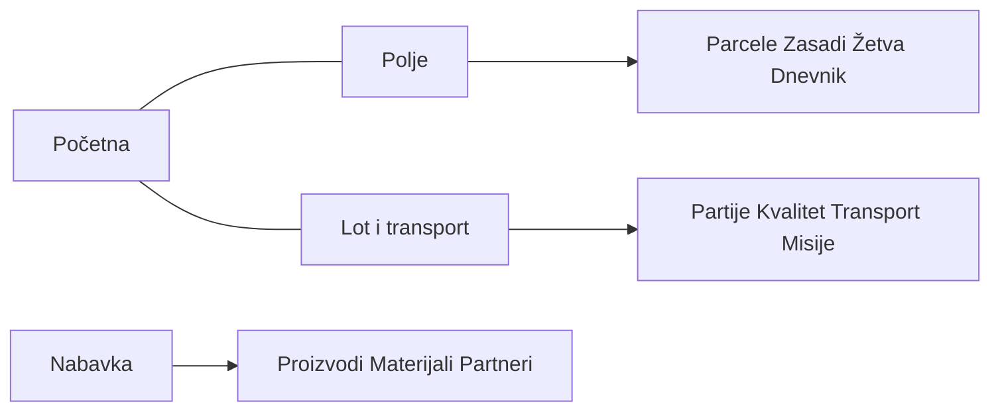

**Povezano:** [`WEB_MOBILE_CHANNEL_PARITY_PLAN.md`](WEB_MOBILE_CHANNEL_PARITY_PLAN.md) · [`GROWER_FLOW_PREREQUISITES_AND_PARITY.md`](GROWER_FLOW_PREREQUISITES_AND_PARITY.md)

# Grower mobilna aplikacija — informaciona arhitektura i navigacija (redizajn)

**Cilj:** jasniji mentalni model za proizvođača: *gde je polje*, *gde je lot i transport*, *gde je nabavka*, umesto jednog dugačkog „Farm tools“ spiska i taba „Proizvodi“ koji ne odgovara svakodnevnom radu.

**Stanje pre redizajna (referenca):**

- Donji tab bar: **Početna · Uputstva · Proizvodi · Profil**
- Većina operativa u stacku + skriveni tabovi (`href: null`)
- Duga lista na ekranu **Farm tools** (`FarmerHomeSection`), dok **Početna** drži glavu, sledeći korak i finansijski teaser

---

## 1. Principi organizacije

1. **Tab = česta namena**, ne pojedinačna API ruta.
2. **Hub ekran** = sekcije sa jasnim ulazima (kartice), ne jedna lista od mnogo stavki.
3. **Isti lanac kao web** (`docs/GROWER_FLOW_PREREQUISITES_AND_PARITY.md`): parcela → plan → teren → lot → kvalitet/usklađenost → transport → praćenje.
4. **Stack ostaje izvor istine** za detalje (`batch/[id]`, `mission/[id]`, …) — menja se kako *dolazimo* do njih.
5. **Offline-outbox i dnevnik** ostaju na **Polje**.

---

## 2. Ciljni donji tab bar (faza 1)

| Tab | Radni naziv | Svrha |
|-----|-------------|--------|
| 1 | **Početna** | Status, sledeći korak, sinhronizacija, finansijski teaser, alerts. Bez duge liste alatki. |
| 2 | **Polje** | Parcele, zasadi, žetva, dnevnik rasta, dnevnik unosa (GPS/foto). Uputstva kao sekcija. |
| 3 | **Lot i transport** | Partije, pakovanje, kvalitet, usklađenost, zahtev za transport, misije, nalepnice, skener. |
| 4 | **Nabavka** | Proizvodi (pasoš), materijali / beli spisak, porudžbine partnera. |
| 5 | **Profil** | Nalog, sertifikati, zabranjene supstance, troškovi, novčanik (i dalje preko `router.push` gde treba). |

**Skriveni tabovi** (bez ikonice u baru): `steps`, `products` (ekran ostaje; otvara se iz Nabavka), `harvest`, `field-log`, `wallet`, `shop`, itd.

---

## 3. Mapiranje: ruta → hub

| Ruta / feature | Hub |
|----------------|-----|
| `(tabs)/index` | Početna |
| `estates`, `plot-mapper` | Polje |
| `plantings`, `(tabs)/harvest`, `growth-journal` | Polje |
| `(tabs)/field-log` | Polje |
| `(tabs)/steps` | Polje (link) |
| `batches`, `batch/[id]`, `packing-flow` | Lot i transport |
| `quality-entry`, `compliance-photos` | Lot i transport |
| `missions-create`, `missions`, `mission/[id]` | Lot i transport |
| `package-badges`, `scanner` | Lot i transport |
| `(tabs)/products`, `materials`, `partner-orders` | Nabavka |
| `(tabs)/profile`, certifikati, … | Profil |

---

## 4. Kod u repou

- `mobile/features/grower/hubs/` — `HubNavTile` + `FieldHubScreen`, `ChainHubScreen`, `SuppliesHubScreen`.
- Postojeći moduli u `features/grower/*` ostaju; menja se samo navigacija.
- Redosled u Lot hub-u usklađen sa web grower navigacijom.

---

## 5. Legacy `farm-tools`

Ruta `/(producer)/farm-tools` ostaje; prikazuje kratku poruku i dugmad ka novim tabovima (bez duplog `FarmerHomeSection` spiska).

---

## 6. Backlog faza

| Faza | Opis |
|------|------|
| F2 | Brojači na hubovima (spremne partije, aktivne misije) iz postojećih hook-ova. |
| F3 | Vizuelni polish sekcija, ilustracije. |
| F4 | Potpuni SR prevod za `producer.hubs.*` u `sr-partial` gde treba. |

---

## 7. Tok (pojednostavljen)

*Poslednja izmena: 2026-05-02.*
