```mermaid
flowchart TB
  LOGIN[Prijava] --> HOME[Početna / index]
  HOME -->|Dodaj njivu| ENEW[estates/new]
  HOME -->|Sledeći korak| FL[field-log]
  HOME -->|Transport| MC[missions-create]
  HOME -->|Misije| MS[missions]
  HOME -->|Obaveštenja| NT[notifications]
  TAB_FIELD[Tab Polje] --> FL
  TAB_FIELD --> EST[estates]
  TAB_FIELD --> PLT[plot-mapper]
  TAB_FIELD --> PLN[plantings]
  TAB_FIELD --> HRV[harvest]
  TAB_FIELD --> GJ[growth-journal]
  TAB_FIELD --> STP[steps]
  TAB_CHAIN[Tab Lot] --> BAT[batches]
  TAB_CHAIN --> PK[packing-flow]
  TAB_CHAIN --> QL[quality-entry]
  TAB_CHAIN --> CP[compliance-photos]
  TAB_CHAIN --> MC
  TAB_CHAIN --> MS
  TAB_CHAIN --> PB[package-badges]
  TAB_SUP[Tab Nabavka] --> MAT[materials]
  TAB_SUP --> PO[partner-orders]
  TAB_PROF[Tab Profil] --> WAL[wallet]
  TAB_PROF --> SET[settings]
  LOGIN --> TAB_FIELD
  LOGIN --> TAB_CHAIN
  LOGIN --> TAB_SUP
  LOGIN --> TAB_PROF
```

# BioVera — mapa UI tekstova (srpski)

> Generisano: `node scripts/generate-ui-copy-map.mjs`
> Kompletan rečnik: `mobile/i18n/locales/sr-partial.json` (~1400+ ključeva pod `producer.*`) i `web/locales/sr.json` (`grower.*`, `growerPages.*`, `adminPages.*`).

## Donji meni — mobilna aplikacija (proizvođač)

```
Početna | Polje | Lot | Nabavka | Profil
```



---

## Mobilna aplikacija — ekran po ekranu

## Početna

- **Ruta:** `/(producer)/(tabs)/index — Početna`
- **Dolazi sa:** Prijava (proizvođač)

### Tekstovi na ekranu

- **producer.brand.ribbon** → Kompletna sledljivost od parcele do isporuke.
- **producer.brand.ribbonSub** → Dokumentovan svaki korak.
- **producer.dashboard.greeting** → Vaš pregled za danas.
- **producer.dashboard.greetingName** → {{name}}, vaš pregled za danas.
- **producer.dashboard.defaultFarmName** → Pregled gazdinstva
- **producer.dashboard.homeLeadShort** → Pregled farme i sledeći korak.
- **producer.dashboard.homeKpi.parcels** → Aktivne parcele
- **producer.dashboard.homeKpi.chain** → Lotovi u procesu
- **producer.dashboard.homeKpi.outbox** → Spremno za otpremu
- **producer.dashboard.nextStep.eyebrow** → Šta dalje
- **producer.dashboard.journey.blockTitle** → Lanac vašeg proizvoda — parcela → lot → pakovanje → predaja
- **producer.offline.banner** → Niste na mreži. Podaci prikazuju poslednje sinhronizovano stanje. Promene će se poslati automatski po uspostavljanju veze.

## Parcele i evidencija

- **Ruta:** `/(producer)/(tabs)/field — tab Polje`
- **Dolazi sa:** Donji meni → Polje

### Tekstovi na ekranu

- **producer.tabs.field** → Polje
- **producer.hubs.field.leadShort** → Upravljanje parcelama, sezonska evidencija i terenska dokumentacija.
- **producer.hubs.field.sectionRecords** → Dnevni unos
- **producer.hubs.field.sectionFarm** → Njive i zone
- **producer.hubs.field.sectionSeason** → Sezona
- **producer.hubs.field.sectionGuide** → Uputstvo

## Dnevnik rada

- **Ruta:** `/(producer)/(tabs)/field-log — Dnevnik unosa`
- **Dolazi sa:** Početna → Sledeći korak / Polje → Dnevnik unosa

### Tekstovi na ekranu

- **producer.tabs.fieldLog** → Dnevnik rada
- **producer.hubs.field.fieldLogDesc** → Tretman, setva, berba — evidencija sa fotografijom i GPS lokacijom.
- **producer.dashboard.fieldLogDesc** → Šta si uradio

## Gazdinstva i parcele

- **Ruta:** `/(producer)/estates — Moja polja i parcele`
- **Dolazi sa:** Polje → Moja polja i parcele

### Tekstovi na ekranu

- **producer.hubs.field.estatesTitle** → Gazdinstva i parcele
- **producer.hubs.field.estatesDesc** → Registrovana gazdinstva, parcelni blokovi, status verifikacije.

## Registruj gazdinstvo

- **Ruta:** `/(producer)/estates/new — Nova njiva`
- **Dolazi sa:** Početna → Dodaj njivu

### Tekstovi na ekranu

- **producer.dashboard.nextStep.addFieldTitle** → Registruj gazdinstvo
- **producer.dashboard.nextStep.addFieldBody** → Jedna njiva je dovoljna za početak. Kasnije možeš dodati još.
- **producer.dashboard.nextStep.addFieldCta** → Registruj gazdinstvo

## Mapiranje zona

- **Ruta:** `/(producer)/plot-mapper — Plan zona parcele`
- **Dolazi sa:** Polje → Plan zona parcele

### Tekstovi na ekranu

- **producer.hubs.field.plotMapperTitle** → Mapiranje zona
- **producer.hubs.field.plotMapperDesc** → Podjela parcele na proizvodne zone.

## Moji zasadi

- **Ruta:** `/(producer)/plantings — Zasadi`
- **Dolazi sa:** Polje → Zasadi i planovi

### Tekstovi na ekranu

- **producer.plantings.screenTitle** → Moji zasadi
- **producer.plantings.introShort** → Za novi zasad pritisni +; za detalje (parcela, površina, usev) dodirni zapis. Isti podaci kao na webu.
- **producer.plantings.addAccessibility** → Dodaj zasad
- **producer.plantings.formSectionTitle** → Novi zasad

## Berba

- **Ruta:** `/(producer)/(tabs)/harvest — Žetva`
- **Dolazi sa:** Polje → Žetva

### Tekstovi na ekranu

- **producer.tabs.harvest** → Berba
- **producer.hubs.field.harvestDesc** → Plan berbe i PHI intervali.
- **producer.dashboard.reportHarvest** → Žetva

## Dnevnik rasta

- **Ruta:** `/(producer)/growth-journal — Dnevnik rasta`
- **Dolazi sa:** Polje → Dnevnik rasta

### Tekstovi na ekranu

- **producer.hubs.field.growthJournalTitle** → Dnevnik rasta
- **producer.hubs.field.growthJournalDesc** → Fotodokumentacija napretka po parceli.

## Uputstvo

- **Ruta:** `/(producer)/(tabs)/steps — Uputstva (sezona)`
- **Dolazi sa:** Početna / Polje → Uputstva

### Tekstovi na ekranu

- **producer.tabs.steps** → Uputstvo
- **producer.hubs.field.stepsDesc** → Kompletan proces na jednoj stranici.
- **producer.dashboard.seasonGuideTitle** → Uputstvo za sezonu
- **producer.dashboard.seasonGuideSubtitle** → Koraci: parcele, odobrenje, lanac žetve i transport.

## Vodič kroz aplikaciju

- **Ruta:** `/(producer)/app-guide — Vodič aplikacije`
- **Dolazi sa:** Polje → Vodič

### Tekstovi na ekranu

- **producer.appGuide.cardTitle** → Vodič kroz aplikaciju
- **producer.appGuide.cardBody** → Kako koristiti svaku funkciju.

## Lot i distribucija

- **Ruta:** `/(producer)/(tabs)/chain — tab Lot`
- **Dolazi sa:** Donji meni → Lot

### Tekstovi na ekranu

- **producer.tabs.chain** → Lot
- **producer.hubs.chain.title** → Lot i distribucija
- **producer.hubs.chain.leadShort** → Post-berba: formiranje lota, pakovanje po standardu, otprema.
- **producer.hubs.chain.sectionLots** → Lotovi i pakovanje
- **producer.hubs.chain.sectionQuality** → Kvalitet i usklađenost
- **producer.hubs.chain.sectionTransport** → Transport
- **producer.hubs.chain.sectionBadges** → Identifikacija pakovanja

## Lotovi

- **Ruta:** `/(producer)/batches — Lotovi (lista)`
- **Dolazi sa:** Lot → Lotovi

### Tekstovi na ekranu

- **producer.tabs.batches** → Lotovi
- **producer.hubs.chain.batchesDesc** → Kreiranje i pregled lotova.

## Lotovi

- **Ruta:** `/(producer)/batch-new — Novi lot`
- **Dolazi sa:** Lotovi → + novi

### Tekstovi na ekranu

- **producer.batches.listScreenTitle** → Lotovi
- **producer.batches.listLeadOneLine** → Svaki lot ima javni BATCH-ID i sistemski ID; zatim slike pakovanja i zahtev za prevoz.

## Lot

- **Ruta:** `/(producer)/batch/[id] — Detalj lota`
- **Dolazi sa:** Lotovi → kartica lota

### Tekstovi na ekranu

- **producer.batches.lotLabel** → Lot
- **producer.batches.lotSystemBatchId** → Batch ID (sistem)
- **producer.batches.filterDone** → Isporučeno
- **producer.batches.filterMoving** → U transportu

## Pakovanje

- **Ruta:** `/(producer)/packing-flow — Pakovanje`
- **Dolazi sa:** Lot → Pakovanje (GPS + foto)

### Tekstovi na ekranu

- **navigation.packingFlow** → Pakovanje
- **producer.hubs.chain.packingDesc** → GPS verifikacija i fotodokumentacija ambalaže.

## Kvalitet

- **Ruta:** `/(producer)/quality-entry — Kvalitet`
- **Dolazi sa:** Lot → Unos kvaliteta

### Tekstovi na ekranu

- **producer.hubs.chain.qualityTitle** → Kvalitet
- **producer.hubs.chain.qualityDesc** → Unos parametara kvaliteta po seriji.

## Fotografije usklađenosti

- **Ruta:** `/(producer)/compliance-photos — Usklađenost`
- **Dolazi sa:** Lot → Fotografije usklađenosti

### Tekstovi na ekranu

- **producer.hubs.chain.complianceTitle** → Fotografije usklađenosti
- **producer.hubs.chain.complianceDesc** → Obavezni tipovi: etiketa, ambalaža, vizuelni pregled.

## Zatraži prevoz

- **Ruta:** `/(producer)/missions-create — Zatraži transport`
- **Dolazi sa:** Početna / Lot → Zatraži transport

### Tekstovi na ekranu

- **navigation.requestTransport** → Zatraži prevoz
- **producer.hubs.chain.transportDesc** → Operativa dodeljuje prevoznika i rutu.
- **producer.dashboard.nextStep.requestTransportTitle** → Zatraži prevoz
- **producer.dashboard.nextStep.requestTransportBody** → Lot je spakovan — pošalji zahtev za transport. Operativa dodeljuje vozača kad je sve spremno (potrebna su usklađenost i gajbe).

## Misije

- **Ruta:** `/(producer)/missions — Lista misija`
- **Dolazi sa:** Lot / Početna → Misije

### Tekstovi na ekranu

- **producer.hubs.chain.missionsTitle** → Misije
- **producer.hubs.chain.missionsDesc** → Status prevoza i hladan lanac u realnom vremenu.
- **producer.tabs.missions** → Prevoz

## Detalji zadatka

- **Ruta:** `/(producer)/mission/[id] — Detalj misije`
- **Dolazi sa:** Misije → red

### Tekstovi na ekranu

- **producer.missions.detailScreenTitle** → Detalji zadatka
- **producer.missions.status.AWAITING_APPROVAL** → Čeka odobrenje (Bio Vera)
- **producer.missions.status.COMPLETED** → Završeno

## Serijski brojevi

- **Ruta:** `/(producer)/package-badges — Nalepnice`
- **Dolazi sa:** Lot → Nalepnice / serije

### Tekstovi na ekranu

- **producer.packageBadges.title** → Serijski brojevi
- **producer.packageBadges.subtitle** → Registruj glavni serijski broj (paleta ili rola) i opcione serije gajbi. Poveži lot da QR otvori pasoš proizvoda.
- **producer.packageBadges.submit** → Registruj nalepnice

## Skener

- **Ruta:** `/(producer)/scanner — Skeniraj`
- **Dolazi sa:** Lot → Skeniraj QR/barkod

### Tekstovi na ekranu

- **navigation.scanBarcode** → Skener
- **producer.hubs.chain.scanDesc** → QR ili barkod skeniranje.

## Nabavka i materijali

- **Ruta:** `/(producer)/(tabs)/supplies — tab Nabavka`
- **Dolazi sa:** Donji meni → Nabavka

### Tekstovi na ekranu

- **producer.tabs.supplies** → Nabavka
- **producer.hubs.supplies.title** → Nabavka i materijali
- **producer.hubs.supplies.leadShort** → Sertifikovani inputi, porudžbine i katalog proizvoda.
- **producer.hubs.supplies.sectionOrders** → Porudžbine
- **producer.hubs.supplies.sectionInputs** → Za njivu
- **producer.hubs.supplies.sectionOffer** → U sistemu

## Materijali

- **Ruta:** `/(producer)/materials — Materijali`
- **Dolazi sa:** Nabavka → Materijali

### Tekstovi na ekranu

- **producer.dashboard.farmer.materialsTitle** → Materijali
- **producer.hubs.supplies.materialsDesc** → Sertifikovani inputi — sjeme, đubrivo, ambalaža.

## Kalkulator troškova

- **Ruta:** `/(producer)/(tabs)/cost-calculator — Troškovi`
- **Dolazi sa:** Nabavka → Troškovi

### Tekstovi na ekranu

- **producer.costCalculator.title** → Kalkulator troškova
- **producer.dashboard.costCalculatorDesc** → Pogledaj troškove

## Moji proizvodi

- **Ruta:** `/(producer)/(tabs)/products — Moji proizvodi`
- **Dolazi sa:** Nabavka → Moji proizvodi

### Tekstovi na ekranu

- **producer.hubs.supplies.productsTitle** → Moji proizvodi
- **producer.hubs.supplies.productsDesc** → Katalog registrovanih proizvoda.

## Porudžbine partnera

- **Ruta:** `/(producer)/partner-orders — Porudžbine partnera`
- **Dolazi sa:** Nabavka → Porudžbine snabdevača

### Tekstovi na ekranu

- **producer.dashboard.partnerOrders.title** → Porudžbine partnera
- **producer.dashboard.partnerOrders.screenLeadShort** → Porudžbine inputa i poruke snabdevača.
- **producer.dashboard.partnerOrders.emptyOrdersShort** → Još nema porudžbina — otvori mapu snabdevača.

## Profil

- **Ruta:** `/(producer)/(tabs)/profile — tab Profil`
- **Dolazi sa:** Donji meni → Profil

### Tekstovi na ekranu

- **producer.tabs.profile** → Profil
- **producer.dashboard.homeFinanceTeaserTitle** → Finansije
- **producer.dashboard.educationBannerTitle** → Edukacija
- **producer.tabs.settings** → Podešavanja

## Novčanik

- **Ruta:** `/(producer)/(tabs)/wallet — Novčanik`
- **Dolazi sa:** Profil → Novčanik

### Tekstovi na ekranu

- **producer.tabs.wallet** → Novčanik
- **producer.dashboard.financialOrders.title** → Finansijski pregled

## Obaveštenja

- **Ruta:** `/(producer)/notifications — Obaveštenja`
- **Dolazi sa:** Početna / Profil / Nabavka

### Tekstovi na ekranu

- **notificationsCenter.title** → Obaveštenja
- **producer.dashboard.nextStep.notificationsBody** → Poruke od operativa ili status transporta.

## Edukacija

- **Ruta:** `/(producer)/education — Edukacija`
- **Dolazi sa:** Profil → Edukacija

### Tekstovi na ekranu

- **producer.dashboard.educationBannerTitle** → Edukacija
- **producer.dashboard.educationBannerSubtitle** → Standardi, video materijali, odgovornost.

## Podešavanja

- **Ruta:** `/(producer)/(tabs)/settings — Podešavanja`
- **Dolazi sa:** Profil → Podešavanja

### Tekstovi na ekranu

- **producer.tabs.settings** → Podešavanja
- **producer.profile.offlineQueueLabel** → Čeka slanje (uređaj)

## Sertifikati

- **Ruta:** `/(producer)/(tabs)/certifications — Sertifikati`
- **Dolazi sa:** Uputstva / alati

### Tekstovi na ekranu

- **producer.tabs.certifications** → Sertifikati
- **producer.dashboard.certificationsDesc** → Tvoji sertifikati

## Zabranjene supstance

- **Ruta:** `/(producer)/(tabs)/banned-substances — Zabranjeno`
- **Dolazi sa:** Uputstva / alati

### Tekstovi na ekranu

- **producer.tabs.bannedSubstances** → Zabranjene supstance
- **producer.dashboard.bannedSubstancesDesc** → Šta nije dozvoljeno

## Alati na farmi

- **Ruta:** `/(producer)/farm-tools — Alati na farmi (legacy)`
- **Dolazi sa:** Stari link

### Tekstovi na ekranu

- **producer.dashboard.farmToolsTitle** → Alati na farmi
- **producer.dashboard.legacyFarmToolsBody** → Otvori Polje za parcele i dnevnik, Lot za lotove i prevoz, Nabavka za materijal i porudžbine partnera. Posle prelaska možeš da zatvoriš ovaj ekran.

---

## Web proizvođač (/grower/*) — sidebar redosled

```
Kontrolna tabla
Uputstva
Moje parcele
Moji zasadi
Materijali
Dobavljači i porudžbine
Moji lotovi
Dnevnik unosa
Terenski unos
Kvalitet
Usklađenost (fotografije)
Edukacija
Vodič za aplikaciju
Partnerski planovi (zaštićeno)
Zahtev za transport
Lista transportnih misija
Moj profil
Bedževi na pakovanju
Skeniraj nalepnice
Skeniraj palete
Štamparska porudžbina
```

## Kontrolna tabla

- **URL:** `/grower`
- **Dolazi sa:** Prijava proizvođača (web)

### Tekstovi

- **grower.nav.dashboard** → Kontrolna tabla

## Uputstva

- **URL:** `/grower/season`
- **Dolazi sa:** Sidebar → Uputstva

### Tekstovi

- **grower.nav.steps** → Uputstva

## Moje parcele

- **URL:** `/grower/fields`
- **Dolazi sa:** Sidebar → Moje parcele

### Tekstovi

- **grower.nav.myFields** → Moje parcele
- **grower.placeholders.openParcels** → Idi na moje parcele

## Moji zasadi

- **URL:** `/grower/plantings`
- **Dolazi sa:** Sidebar → Moji zasadi

### Tekstovi

- **grower.placeholders.plantingsTitle** → Moji zasadi
- **grower.placeholders.plantingsBody** → Zasadi pripadaju svakoj parceli. Puni uredjivač stiže ovde; do tada unosite blokove i usev u Moje parcele, a dnevne zapise u mobilnoj aplikaciji.

## Materijali

- **URL:** `/grower/materials`
- **Dolazi sa:** Sidebar → Materijali

### Tekstovi

- **grower.nav.materials** → Materijali

## Moji lotovi

- **URL:** `/grower/batches`
- **Dolazi sa:** Sidebar → Moji lotovi

### Tekstovi

- **grower.nav.myBatches** → Moji lotovi

## Dnevnik unosa

- **URL:** `/grower/field-diary`
- **Dolazi sa:** Sidebar → Dnevnik

### Tekstovi

- **grower.placeholders.fieldDiaryTitle** → Dnevnik unosa
- **grower.placeholders.fieldDiaryBody** → U aplikaciji birate njivu → parcelu → plan useva (zasad ili berba). Barkod materijala je opciono kad važi; fotografija + GPS obavezni pri svakom unosu — od prvog dana — i grade trag ka pasošu. Ovde je samo pregled po polju ili parceli.

## Terenski unos

- **URL:** `/producer/field-entry`
- **Dolazi sa:** Sidebar → Terenski unos

### Tekstovi

- **grower.nav.fieldCapture** → Terenski unos

## Skeniraj palete

- **URL:** `/grower/package-badges/scan`
- **Dolazi sa:** Sidebar → Skeniraj palete

### Tekstovi

- **grower.nav.scanPallets** → Skeniraj palete

## Kvalitet

- **URL:** `/grower/quality-entry`
- **Dolazi sa:** Sidebar → Kvalitet

### Tekstovi

- **grower.nav.qualityEntry** → Kvalitet

## Usklađenost (fotografije)

- **URL:** `/grower/compliance-photos`
- **Dolazi sa:** Sidebar → Usklađenost

### Tekstovi

- **grower.nav.compliancePhotos** → Usklađenost (fotografije)

## Edukacija

- **URL:** `/grower/education`
- **Dolazi sa:** Sidebar → Edukacija

### Tekstovi

- **grower.nav.education** → Edukacija

## Vodič za aplikaciju

- **URL:** `/grower/app-guide`
- **Dolazi sa:** Sidebar → Vodič

### Tekstovi

- **grower.appGuide.pageTitle** → Kako koristiti aplikaciju
- **grower.appGuide.pageDescription** → Korak po korak kroz mobilnu Bio Vera aplikaciju za proizvođače — sa snimcima ekrana telefona.

## Partnerski planovi (zaštićeno)

- **URL:** `/grower/confidential`
- **Dolazi sa:** Sidebar → Partner planovi

### Tekstovi

- **grower.nav.confidential** → Partnerski planovi (zaštićeno)

## Dobavljači i porudžbine

- **URL:** `/grower/where-to-buy`
- **Dolazi sa:** Sidebar → Dobavljači

### Tekstovi

- **grower.nav.suppliersAndOrders** → Dobavljači i porudžbine

## Zahtev za transport

- **URL:** `/grower/missions/create`
- **Dolazi sa:** Sidebar → Zahtev transport

### Tekstovi

- **grower.nav.requestTransport** → Zahtev za transport

## Lista transportnih misija

- **URL:** `/grower/portal`
- **Dolazi sa:** Sidebar → Misije

### Tekstovi

- **grower.nav.missionTracker** → Lista transportnih misija

## Moj profil

- **URL:** `/grower/profile`
- **Dolazi sa:** Sidebar → Profil

### Tekstovi

- **grower.nav.myProfile** → Moj profil

## Kontrola proizvođača

- **URL:** `/admin/grower-control`
- **Dolazi sa:** Admin → Kontrola proizvođača

### Tekstovi

- **adminPages.titles.growerControl** → Kontrola proizvođača

---

## Ostale uloge u mobilnoj aplikaciji (kratko)

| Uloga | Folder | Tabovi / ulaz |
|-------|--------|----------------|
| Kupac | `app/(buyer)` | Shop, porudžbine |
| Logistika | `app/(logistics)` | Misije, vozila |
| Snabdevač | `app/(supplier)` | Katalog, porudžbine |

Prevodi: `sr-partial.json` prefiksi `buyer.*`, `logistics.*`, `supplier.*`, `auth.*`.

## Javni web (marketing)

| Stranica | URL | Locale ključevi |
|----------|-----|-----------------|
| Početna | `/[locale]` | `hero*`, `home*` u `web/locales/sr.json` |
| Proizvođači | `/[locale]/growers` | `growersPage.*` |
| FAQ, kontakt, legal | `/[locale]/faq` itd. | po namespace-u stranice |

Slogan lanca: **Od njive do police** (`producer.brand.ribbon`, `growerJourney.tagline`).