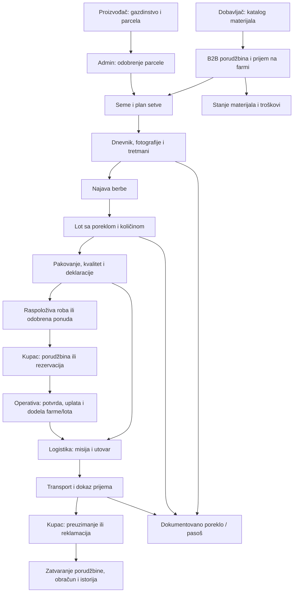

# Funkcionalna analiza mobilne aplikacije — 26.09.2026.

## Zaključak

Aplikacija ima stvarne veze sa backendom, ali nema zatvoren put informacije kroz sve korake. Na jednom mestu korisnik dobije potvrdu iako ništa nije sačuvano; na drugom podatak stigne u bazu, ali nema ekrana koji ga ponovo učitava; na trećem nedostaje identifikator kojim bi sledeći ekran nastavio rad. Zato pojedinačni ekrani mogu izgledati završeno, a ceo posao ipak ostati nedovršen.

Analiza obuhvata **93 rutna fajla, grupisana u 31 funkcionalni tok**. [Registar ekrana](REGISTAR_EKRANA_2026-09-26.md) povezuje svaku rutu sa tokom. Pročitani su rutni i povezani feature kod, API adapteri, ključni backend servisi i Prisma veze. Za četiri navigaciona slučaja izvršene su same funkcije za preusmeravanje. Nije izvršen kompletan test na uređaju niti je provereno stanje produkcione baze. „Povezano“ u ovom dokumentu znači da veza postoji u pregledanom kodu.

Prvobitna analiza ispod opisuje stanje pre popravki. Naknadno je implementirano [povezivanje postojećeg lota sa pakovanjem, kvalitetom i transportom](POVEZIVANJE_LOTA_2026-09-26.md): A06 je obrađen u kodu i jediničnim testovima; A16 delimično u adapteru lotova. Naknadno je obrađen i [A07: plan berbe → lot → misija i ponavljanje neuspelog zahteva](PLAN_LOT_MISIJA_2026-09-26.md), sa HTTP/PostgreSQL proverama i navedenim granicama. Ostali nalazi ostaju otvoreni.

## Kako posao treba da teče

Zatim je dodat [nastavak A11: misija → dostava i odluka o reklamaciji](MISIJA_DOSTAVA_REKLAMACIJA_2026-09-26.md): administrativna veza, transakcione promene transporta, odluka sa auditom i prikaz kupcu. Fizički povrat, refundacija i složenije alokacije ostaju van ovog koraka.

Naknadni nastavak [primopredaja → prijem kupca → pregled problema](PRIMOPREDAJA_PRIJEM_2026-09-26.md) obrađuje konkretne linkove A10 i trajne slike A12, te uvodi kupčev prijem, prijavu i administratorsko čitanje iz A11. A11 ostaje delimičan: nema odluke/zatvaranja reklamacije niti automatske veze svake misije sa dostavom. Nalazi ispod ostaju istorijski opis prvobitnog pregleda; obim i provere popravki su u povezanom izveštaju.

Ovo je **ciljni tok**, a ne tvrdnja da sve strelice već rade:

Krajnja informacija ne mora uvek da otvara novi ekran. Uputstvo može da se završi čitanjem. Evidencija troška može da se završi trajno sačuvanim i dostupnim zapisom. Ali **porudžbina, dokaz, zahtev ili promena statusa moraju imati trajni rezultat, odgovornog primaoca i vidljiv sledeći korak**.

## Mapa opcija i njihovog nastavka

Oznake: **Povezano** = postoje server i povratni prikaz; **Delimično** = deo lanca postoji, ali nije zatvoren; **Prekid** = potvrđen prekid u pregledanom kodu; **Informativno** = nema poslovnog upisa. Oznake nisu ocena vizuelnog kvaliteta niti rezultat E2E testa.

### Ulaz i zajedničke funkcije

| Tok | Opcija i ulaz | Gde informacija sada završava | Ko je koristi dalje / šta treba da usledi | Nalaz |
|---|---|---|---|---|
| U01 | Početna, prijava kupca/partnera, postojeća sesija | `/auth/login` → korisnik/JWT → lokalna sesija → početna ruta po ulozi | Ekrani i API autorizacija moraju koristiti isto tumačenje uloge | **Delimično:** DRIVER i SUPER_ADMIN nemaju početnu rutu; A13 |
| U02 | Registracija proizvođača i kupca | `/auth/register/grower`, `/auth/register/buyer` → korisnički podaci; kupac šalje i poslovne/lokacijske podatke | Potvrda naloga gde je potrebna → prijava → pravi profil tog korisnika | **Delimično:** registracija i profil kupca nisu spojeni u UI; A01 |
| U03 | QR skeneri, mapa i izbor prodavnice | QR često ide u zajednički AsyncStorage ključ; mapa čita javne lokacije i B2B dobavljače | Tačno određen formular treba da potroši rezultat skena i veže ga za parcelu/proizvod/paket | **Delimično:** lokalna predaja skena postoji; nije isto što i serverska registracija semena |
| U04 | Obaveštenja i push | `notifications` → pročitano → resolver web adrese u mobilnu rutu | Osoba otvara konkretan zadatak, sa istim orderId/missionId/handoverId | **Prekid:** primopredaja kupca završava na dashboardu; drugi linkovi gube kontekst; A10 |

### Proizvođač

| Tok | Opcija i ulaz | Gde informacija sada završava | Ko je koristi dalje / šta treba da usledi | Nalaz |
|---|---|---|---|---|
| P01 | Početna, Polje, Lanac, Nabavka i podmeniji | Zbirni podaci i navigacija u postojeće ekrane | Svaka kartica treba da otvori odgovarajući posao ili izbor njegovog zapisa | **Delimično:** npr. Pakovanje se otvara bez lota; A06 |
| P02 | Novo gazdinstvo, granice, parcela, izmena | `/estates`, `/parcels/estate/:id` → `estates`, `parcels`; parcela ima odobrenje | Admin u `/admin/parcels-pending` → proizvođač bira odobrenu parcelu za naredne unose | **Povezano u kodu:** jasno imenovati čekanje na admina i mogućnost nastavka |
| P03 | Seme: skeniranje ili ručni unos sa slikom/GPS | QR radi validaciju; ručni unos zove `/seed-registrations`, pa ignoriše grešku i označava korak završenim | Trajna registracija/odobrenje semena → vezivanje za parcelu i setvu | **Prekid:** ručni endpoint nije pronađen među backend kontrolerima; lažan uspeh; A03 |
| P04 | Setva i najava berbe | `/harvest-announcements` → `harvest_announcements` tipa PLANTING/HARVEST; offline red kada je predviđen | Dnevnik koristi plan; HARVEST pokušava da otvori misiju; lot treba da zadrži ID plana berbe | **Delimično:** neuspeh otvaranja misije samo se loguje; ID izabranog plana ne ulazi u lot; A07 |
| P05 | Terenski dnevnik i dnevnik rasta | Offline unos → `/growth-logs` sa parcelom, planom, slikom/GPS; `growth_logs`, povezani tretmani i admin obaveštenja | Moderacija/admin, istorija parcele, dokaz porekla i dalje odluke o berbi | **Povezano uz ograničenja:** lokalni red i istorija traže vlasnika naloga; A14 |
| P06 | Crtanje unutrašnjeg plana parcele | `/plot-mapper/save` → `plot_blueprints`; učitavanje po parceli | Korisnik ponovo otvara isti plan; ako zone upravljaju proizvodnjom, potrebna veza sa setvama/dnevnikom | **Delimično:** nacrt je sačuvan; nije automatsko stvaranje novih parcela/setvi |
| P07 | Vera Bag i sertifikati | Vera Bag: React memorija. Sertifikati: lokalni red → `grower_mobile_ingest` sa metapodacima | Stvarna datoteka → trajni dokaz → pregled/odobrenje → status vidljiv proizvođaču/adminu | **Prekid:** A04 i A05 |
| P08 | Lista lotova, novi lot, detalj | `/batches` → `batches`, UUID i javni BATCH kod; detalj kroz `/traceability` | Isti lot → pakovanje → kvalitet → deklaracije → transport → raspoloživost/pasoš | **Delimično:** veza sa izabranim planom berbe nije sačuvana; A07 |
| P09 | Pakovanje, ocena kvaliteta, kontrolne fotografije i nalepnice | `/batches/:id/packing-flow`, `/quality-entry`, `/material-control/*` → audit, quality, compliance zapisi | Kontrola spremnosti konkretnog lota → zahtev za transport/utovar | **Delimično:** kvalitet i compliance imaju API; ulaz u pakovanje nema batchId; A06 |
| P10 | Paketi/deklaracije, roditelj/deca, zahtevi za štampu | `package_badges`, zahtevi za štampu i transferi; info ekran kaže da štampu vodi dobavljač na webu | Dobavljač/fabrika → preuzimanje rolne/paketa → proizvođač → lot i sledljivost | **Delimično:** web završetak može biti nameran, ali treba konkretan link i status, ne samo tekst |
| P11 | Transport: lista, kreiranje, detalj | `/missions` → `missions`; kvalitet/compliance i izabrani lot određuju spremnost | Logistički partner preuzima → utovar → kretanje → prijem → povratna informacija proizvođaču | **Povezano uz praznine:** različiti izvori misija i veza sa porudžbinom/lotom nisu jedan jedinstven tok |
| P12 | Porudžbine proizvođača | Mobilna lista koristi `ordersAPI.getAll()` → `GET /orders` → filter `buyerId = trenutni korisnik` | Treba da vidi porudžbine koje ispunjava njegova farma i sledeći korak isporuke | **Prekid:** pogrešan opseg liste; A08 |
| P13 | Materijali, pretraga, dodavanje, dozvoljena sredstva | `/compliance/white-list` i grower predlog → `bio_white_list`; izbor materijala u dnevniku | Centralna kontrola sredstva → evidentiranje upotrebe/tretmana | **Delimično:** katalog dozvoljenog sredstva nije stanje materijala na farmi |
| P14 | „Proizvodi“ i kalkulator troškova | Lokalni red → `/grower-portal/products` ili `/costs` → `grower_mobile_ingest` | Trajni pregled unosa, trošak uz parcelu/setvu; po potrebi dalje knjiženje u zalihe | **Prekid za proizvode:** uklanjaju se iz reda, a lista čita samo red. Troškovi imaju serversku povratnu listu; A05 |
| P15 | Profil, novčanik, finansijski sažetak | `/farmer-profile/me`, `/wallets/me`, transakcije i financial-dashboard | Prikaz knjiženja nastalih u poslovnom toku plaćanja; operativa rešava isplate/izuzetke | **Povezano za čitanje:** ne tumačiti stanje novčanika kao dokaz bankovne isplate |
| P16 | Koraci, edukacija, preporuke, alati i podešavanja | Uputstva, `/vera-insights`, lokalne preference, push i sync komande | Preporuka → odgovarajući plan/setva; uputstvo → konkretan ekran; preference → ponašanje uređaja | **Informativno/delimično:** dozvoljen završetak čitanjem; lokalni „završen korak“ ne sme dokazivati završen poslovni događaj |

### Kupac, dobavljač i logistika

| Tok | Opcija i ulaz | Gde informacija sada završava | Ko je koristi dalje / šta treba da usledi | Nalaz |
|---|---|---|---|---|
| B01 | B2B prodavnica, razgovor, porudžbina i „primljeno na farmi“ | `supplier_threads`, poruke, `supplier_direct_orders`; prijem upisuje `farmerReceivedAt` | Dobavljač potvrđuje/ispunjava → proizvođač prima → materijal i trošak dostupni za dalji rad | **Delimično:** prijem ne knjiži automatski zalihe ni trošak; A15 |
| K01 | Prodavnica, kategorije, detalj, dashboard, QR pasoš | `/inventory/available`; postoje fallback grane na lotove i tržišne cene; QR otvara pasoš | Izabrana ponuda → korpa/rezervacija sa jasnim poreklom, raspoloživošću i rokom | **Delimično:** demo dashboard i izračunate procene nisu stvarna dostava/status; A02, A09 |
| K02 | Korpa, checkout, direktna rezervacija | `POST /orders` → `orders` sa prodavcem Vera, bez `fulfillingEstateId`; admin dobija obaveštenje | Operativa potvrđuje, dodeljuje farmu, evidentira uplatu i organizuje isporuku | **Delimično:** rezervacija je lokalna oznaka/napomena, bez serverske alokacije lota; A09 |
| K03 | Lista porudžbina, detalj, bankovne instrukcije | `GET /orders`, `GET /orders/:id` → prikaz statusa; detalj ne koristi puni shipmentTracking | Uplata preko operative → stvarni transport → kupčev prijem ili reklamacija → zatvaranje | **Prekid nastavka u mobile:** nedostaje kupčev tok dostava, potvrde i reklamacije; A11 |
| K04 | Firma, lokacije i osoblje kupca | Demo vrednosti + React state, bez poslovnog API poziva | `buyers/company-profile` → checkout lokacija → logistika/odgovorna osoba → admin | **Prekid:** postojeći backend profil nije povezan; A01 |
| K05 | Vera standard | Informativni sadržaj | Završetak čitanjem; opciono povratak na ponudu/pasoš | **Informativno** |
| L01 | Logistički dashboard, misije, preuzimanje posla, vozila/vozači | `/missions/my-missions?scope=logistics`, claim/lifecycle, `/logistics-partner/vehicles`, `/drivers` | Partner → dodeljena misija/vozač → obavezni dokazi → promena statusa → nalogodavac vidi rezultat | **Delimično:** DRIVER prijava i backend provere nisu usklađeni; mobilni vozači su samo pregled |
| L02 | Utovar i potpis primaoca za misiju | `/quality-entry/handover`, receiver-proof → `logistics_handovers` i PDF | Promena životnog ciklusa misije i obaveštenje vezanoj porudžbini kada orderId postoji | **Povezano u kodu:** ovo nije isto što i kupčeva završna primopredaja u L03 |
| L03 | Vozačev početak i primaočevo završavanje primopredaje | `/digital-handover/initiate`, `/complete` → `digital_handovers`, `deliveries`, `orders`, ili spor | Kupac potvrđuje prijem / problem → administracija i plaćanje → istorija | **Prekid ulaza/dokaza:** obaveštenje ne dovodi ovde; fotografije se šalju kao lokalne URI adrese; A10–A12 |
| S01 | Dobavljački dashboard, katalog, porudžbine, poruke | `/b2b-suppliers/*` → profil, katalog, poruke i status porudžbine | Ponuda ide proizvođaču; potvrda/ispunjenje vraćaju se u njegov pregled; prijem je sledeći događaj | **Povezano do prijema:** dalje knjiženje materijala/troška nije završeno; A15 |
| S02 | Prijem deklaracija iz fabrike i transfer proizvođaču | `/package-badges/supplier/*` → stanje/transfer paketa i materijala | Proizvođač dobija serijske brojeve → veže za paket/lot → kontrola/pasoš | **Povezano u kodu:** kompletan fizički ciklus i povrat zahtevaju zaseban E2E test |

## Potvrđeni prekidi i dokaz u kodu

### A01 — Profil kupca nije profil njegovog naloga

`useProfileData` počinje firmom Aldi Nord i unapred upisanim lokacijama/osobljem. Dodavanje i brisanje menjaju samo lokalni React state. Osvežavanje čeka `Promise.resolve()`. Backend već ima GET/PUT `/buyers/company-profile`.

**Posledica:** korisnik unese lokaciju ili osobu, ali administracija i checkout ne dobiju taj unos; nakon ponovnog otvaranja ekrana podaci se vraćaju na početne vrednosti.

**Potrebna veza:** korisnik → sopstveni company-profile → stabilni locationId/personId → izbor sačuvane lokacije pri kupovini → snimak adrese i odgovorne osobe uz porudžbinu. Osoblje u profilu nije automatski sistem ovlašćenih korisničkih naloga; tu odluku treba eksplicitno modelovati.

Dokaz: [useProfileData](../../mobile/features/buyer/profile/useProfileData.ts), [BuyersController](../../backend/src/buyers/buyers.controller.ts), [checkout](../../mobile/features/buyer/checkout/BuyerCheckoutScreen.tsx).

### A02 — Početna kupca meša stvarne podatke i demonstraciju

Aktivna dostava je stalno `#2104`; priče o proizvođačima dolaze iz demo prevoda. `enhanceProduct` procenjuje dostavu kao datum berbe + tri dana, a trust score postavlja na 75 ili 50. To nisu preuzete vrednosti konkretne pošiljke ili proizvođača.

**Potrebna veza:** aktivna porudžbina → stvarna misija/dostava → događaj i očekivani rok. Ako nema podataka, prikazati odsustvo podatka ili označenu procenu.

Dokaz: [dashboard data](../../mobile/features/buyer/dashboard/useBuyerDashboardData.ts), [enhanceProduct](../../mobile/features/buyer/dashboard/types.ts), [dashboard UI](../../mobile/features/buyer/dashboard/BuyerDashboardScreen.tsx).

### A03 — Ručno seme prijavljuje uspeh bez sačuvanog rezultata

Unos pokušava `/seed-registrations`, ali unutrašnji `catch` ignoriše svaku grešku, pa se poziva `markStepComplete(2)` i prikazuje uspeh. Ruta nije pronađena u backend kontrolerima. Nema implementiranog offline reda za taj zahtev u ovom toku. QR grana proverava seme, ali validacija nije isto što i vezivanje semena za parcelu.

**Potrebna veza:** trajni seed registration/zahtev sa fotografijom → serverski ID i status → admin pregled ako je potreban → seme vezano za parcelu/setvu. Ne prikazivati „uspešno“ dok je ishod neuspešan ili samo lokalno na čekanju.

Dokaz: [SeedRegistrationScreen](../../mobile/features/grower/seed-registration/SeedRegistrationScreen.tsx), [seedRegistrationsAPI i smartLockAPI](../../mobile/lib/api/grower.ts), [lokalno označavanje koraka](../../mobile/lib/grower-journey.ts).

### A04 — Vera Bag ne čuva dokaze

Komponenta drži fotografije u `useState`; roditeljski `onSave` ponovo upisuje samo `useState`. Nema trajnog lokalnog čuvanja, upload-a ni upisa u bazu. Prosleđeni batchId/parcelId ne stvaraju poslovnu vezu.

**Potrebna veza:** fotografija → datoteka dostupna serveru → evidence ID + parcela/plan/lot + kategorija/vreme/autor → pregled istog dokaza kod proizvođača i ovlašćenog kontrolora. Treba odlučiti da li Vera Bag postaje objedinjeni pregled postojećih growth/compliance dokaza, umesto još jednog paralelnog skladišta.

Dokaz: [VeraBag](../../mobile/components/VeraBag.tsx), [VeraBagScreen](../../mobile/features/grower/vera-bag/VeraBagScreen.tsx).

### A05 — Server je primio unos, ali korisnik nema njegov trajni rezultat

Proizvodi se šalju u `grower_mobile_ingest` kao PRODUCT, zatim brišu iz lokalnog reda. Ekran učitava samo taj lokalni red. Sertifikati idu u isti inbox kao CERT_PHOTO, uz `photoUri` sa uređaja; posle uspeha red se briše, a UI status računa iz lokalnog reda. Tako sertifikat može opet izgledati kao „nije urađeno“. Troškovi imaju GET povratnu listu i predstavljaju bolji obrazac.

**Potrebna veza:** trajni poslovni zapis + list/detail endpoint + status obrade; prava datoteka umesto `file://` putanje. Za svaki PRODUCT/CERT_PHOTO imenovati ko ga obrađuje i kako ga korisnik ponovo vidi. Sam upis JSON-a u inbox nije završena funkcionalnost.

Dokaz: [sync-service](../../mobile/lib/sync-service.ts), [useProductsData](../../mobile/features/grower/products/useProductsData.ts), [useCertificationsData](../../mobile/features/grower/certifications/useCertificationsData.ts), [grower portal ingest](../../backend/src/grower-portal/grower-portal.service.ts).

### A06 — Pakovanje nema lot koji treba da završi

Meni „Posle berbe“ otvara `/(producer)/packing-flow` bez parametra. Wizard zahteva batchId i nema izbor lota na tom ulazu. Pronađeni mobilni navigacioni poziv iz menija ne prosleđuje taj ID.

**Potrebna veza:** detalj lota → „Pakuj ovaj lot“ sa batchId; ulaz iz opšteg menija → izbor lota → isti wizard → sačuvan dokaz → detalj lota sa novim statusom i sledećom radnjom.

Dokaz: [PostHarvestMenuScreen](../../mobile/features/grower/menus/PostHarvestMenuScreen.tsx), [PackingFlowScreen](../../mobile/features/grower/packing-flow/PackingFlowScreen.tsx).

### A07 — Plan berbe, lot i misija nisu pouzdano isti lanac

Novi lot omogućava izbor najave berbe, ali POST payload ne šalje njen ID; `batches` nema direktno polje te veze. Backend kreiranje HARVEST najave pokušava da otvori misiju, ali neuspeh hvata i samo loguje. Zato sačuvana najava ne dokazuje da je nastao logistički posao.

**Potrebna veza:** planting/harvest ID → lot ID → mission ID; jasno dozvoliti više lotova iz jedne berbe ako je to poslovno pravilo. Neuspešan nastavak treba da ima vidljiv status i ponovljiv postupak oporavka. Ručno kreiranje i automatska misija treba da nastavljaju isti zahtev, umesto da lako postanu dva nevezana posla.

Dokaz: [CreateBatchScreen](../../mobile/features/grower/batches/CreateBatchScreen.tsx), [batches API](../../mobile/lib/api/batches.ts), [Prisma model](../../backend/prisma/schema.prisma), [HarvestAnnouncementsService](../../backend/src/harvest-announcements/harvest-announcements.service.ts).

### A08 — Proizvođačke porudžbine čitaju kupčevu listu

`useOrdersListData` poziva `ordersAPI.getAll()`. `GET /orders` poziva `findAllByBuyer(req.user.id)`, a upit filtrira isključivo buyerId. To nije lista porudžbina dodeljenih gazdinstvu tog proizvođača.

**Potrebna veza:** poseban serverski opseg po vlasništvu nad fulfillingEstateId → dozvoljeni detalj → vezani lot/misija/obračun. Ne rešavati otvaranjem administratorske liste svim proizvođačima.

Dokaz: [grower orders hook](../../mobile/features/grower/orders/useOrdersListData.ts), [OrdersController](../../backend/src/orders/orders.controller.ts), [OrdersService](../../backend/src/orders/orders.service.ts).

### A09 — „Rezervisano“ ne znači da je količina lota rezervisana

Mobilni purchase/reservation koriste isti POST `/orders`; razlika je u lokalnoj vrsti stavke i napomeni. Backend proverava cenu, ali kreiranje porudžbine ne pravi `order_items` vezu sa batchId/inventoryId. Dostupnost lota se, međutim, računa upravo iz `order_items`. ProductId iz zahteva koristi se za proveru cene; nije sačuvan kao trajna stavka porudžbine u ovom create toku.

**Posledica:** potvrda porudžbine ne uspostavlja vezu koju brojač rezervisane količine očekuje. Ovo ne znači da cenu klijent određuje sam — provera cene postoji.

**Potrebna veza:** jasno odvojiti komercijalni upit/ponudu od rezervacije realnog lota; pri rezervaciji upisati stavku/alokaciju i atomski kontrolisati raspoloživu količinu. Pri otkazivanju je osloboditi. Kod ponude koja još nema lot, vidljivo označiti čekanje na alokaciju.

Dokaz: [ReservationModal](../../mobile/components/ReservationModal.tsx), [checkout](../../mobile/features/buyer/checkout/BuyerCheckoutScreen.tsx), [OrdersService.create](../../backend/src/orders/orders.service.ts), [getBatchAvailability](../../backend/src/batches/batches.service.ts), [order_items](../../backend/prisma/schema.prisma).

### A10 — Obaveštenje o primopredaji ne otvara primopredaju

Backend šalje `/buyer-portal/handover/:id`. Izvršena mobilna funkcija resolvera za taj link vraća `/(buyer)/dashboard`. Ekran `/manager/handover-complete` postoji, ali ta putanja do njega ne dolazi. Link logističkog receiver ekrana takođe gubi missionId iz query parametra. Zajednička lista obaveštenja pri nedostatku back istorije vraća korisnika na proizvođački profil bez obzira na ulogu.

**Potrebna veza:** poslovni događaj → tip zadatka + ID → ekran dozvoljen za tu ulogu → isti ID ostaje posle prijave i navigacije nazad. Za poslovne linkove ne koristiti tihi fallback na opšti dashboard.

Dokaz: [DigitalHandoverService](../../backend/src/digital-handover/digital-handover.service.ts), [resolveNotificationActionHref](../../mobile/lib/resolve-notification-action.ts), [NotificationsListScreen](../../mobile/features/grower/notifications/NotificationsListScreen.tsx).

### A11 — Kupac vidi porudžbinu, ali nema njen završni tok

Backend ima kupčeve dostave, potvrdu preuzimanja i prijavu problema. Mobilni buyer deo nema odgovarajući zatvoren tok; detalj porudžbine prikazuje status/bankovne podatke, bez akcija za potvrdu preuzimanja ili reklamaciju. Backend pravi i `shipmentTracking`, koji ovaj ekran ne koristi.

**Potrebna veza:** detalj porudžbine → tačna delivery/misija → primopredaja → potvrda kupca ili problem → vidljiv status obrade i rezultat. Vremenski rok za problem mora dolaziti iz serverskog događaja preuzimanja, ne lokalnog sata ili generičkog statusa DELIVERED.

Dokaz: [buyer order detail](../../mobile/app/(buyer)/order/[id].tsx), [DeliveriesController](../../backend/src/deliveries/deliveries.controller.ts), [OrdersService shipment tracking](../../backend/src/orders/orders.service.ts). Web nastavak postoji u [buyer deliveries](../../web/app/buyer-portal/deliveries/page.tsx).

### A12 — Fotografija primopredaje nije dostupna primaocu podatka

Manager ekran uzima `result.assets[0].uri`, šalje ga kao `photoUrls`, a backend te stringove upisuje. Nema upload koraka na toj putanji. Lokalna adresa uređaja nije datoteka dostupna administraciji ili kupcu na drugom uređaju.

**Potrebna veza:** upload/obrada slike → trajni dokaz → URL ili ID dokumenta → primopredaja i eventualni spor. Potpis i fotografije su različiti podaci; to što se potpis šalje kao data URL ne rešava fotografije.

Dokaz: [manager handover](../../mobile/app/manager/handover-complete.tsx), [DigitalHandoverService.completeHandover](../../backend/src/digital-handover/digital-handover.service.ts).

### A13 — Ulaz po ulozi i dalja ovlašćenja nisu ujednačeni

Izvršena `getPostLoginPath(['DRIVER'])` i `getPostLoginPath(['SUPER_ADMIN'])` vraćaju null. Logistički mobilni layout zahteva LOGISTICS_PARTNER. Backend na nekim mestima mapira DRIVER, a na drugim proverava LOGISTICS_PARTNER direktno.

**Potrebna veza:** jedna odobrena matrica uloga → početna ruta → dozvoljene liste/detalji/akcije. Dodavanje linka bez serverskog usklađivanja neće zatvoriti ovaj tok.

Dokaz: [post-login redirect](../../mobile/lib/post-login-redirect.ts), [logistics layout](../../mobile/app/(logistics)/_layout.tsx), [RolesGuard](../../backend/src/auth/guards/roles.guard.ts), [MissionsController](../../backend/src/missions/missions.controller.ts).

Rezultati direktnog izvršavanja postojećih navigacionih funkcija, bez simulatora:

| Ulaz | Dobijeni rezultat | Šta nedostaje |
|---|---|---|
| Početna putanja za DRIVER | `null` | Definisana podrška ulozi i odredište |
| Početna putanja za SUPER_ADMIN | `null` | Odredište ili jasno definisan web nastavak |
| BUYER + `/buyer-portal/handover/test-handover-id` | `/(buyer)/dashboard` | Ekran završetka sa istim handoverId |
| LOGISTICS_PARTNER + `/logistics-partner/handover-receiver?missionId=test-mission-id` | `/(logistics)/handover-receiver` | Prenos missionId |

### A14 — Lokalni unos nema dosledno vlasništvo i sinhronizaciju između prikaza

Offline ključevi su zajednički za uređaj; redovi nemaju dosledan userId vlasnika. Slanje uzima trenutno sačuvan token. To je rizik pri promeni naloga: validacije mogu odbiti unos, a generički ingest može ga vezati za trenutni nalog. Nije izvršen test sa dva naloga, zato ovo nije tvrdnja o potvrđenom curenju podataka na produkciji.

Dodatno, kupčev logout briše `shopping_cart` direktno iz AsyncStorage, dok novi CartStore drži stanje u memoriji. Dok provider ostaje montiran, samo brisanje diska ne čisti taj prikaz. To treba uskladiti preko jedne operacije resetovanja korpe.

**Potrebna veza:** svaki lokalni red/cache ima vlasnika; promena naloga suspenduje tuđi red; svi prikazi koriste isti store i javnu operaciju resetovanja. Lokalni rezultat mora imati server ID i potvrdu kada se sinhronizuje.

Dokaz: [offline-storage](../../mobile/lib/offline-storage.ts), [sync-service](../../mobile/lib/sync-service.ts), [buyer logout](../../mobile/features/buyer/profile/useProfileData.ts), [CartStore](../../mobile/lib/cart-store.ts).

### A15 — Prijem B2B robe ne nastavlja na materijal i trošak

Dobavljač i proizvođač imaju stvarne porudžbine i poruke. `markFarmerReceived` upisuje farmerReceivedAt. U tom postupku nema upisa u stanje materijala ili troškove.

**Potrebna veza:** potvrđen prijem → identifikovan materijal, količina/jedinica i dokument → zaliha na farmi i predlog troška. Automatsko knjiženje cene ne treba izmišljati ako je B2B porudžbina samo dogovor po nazivu bez konačne cene; tada otvoriti zadatak dopune/odobrenja.

Dokaz: [B2bSuppliersService](../../backend/src/b2b-suppliers/b2b-suppliers.service.ts), [PartnerOrders](../../mobile/features/grower/partner-orders/usePartnerOrdersData.ts).

### A16 — Greška učitavanja se često prikazuje kao „nema podataka“

Neki API adapteri hvataju mrežnu grešku i vraćaju prazan niz. Ekran tada nema način da razlikuje prazan katalog/dnevnik od neuspelog upita. Ovo može stvoriti utisak da sačuvani podatak ne postoji ili da aplikacija nije povezana.

**Potrebna veza:** razlikovati učitavanje, prazno, grešku i poslednju lokalnu kopiju sa vremenom sinhronizacije. „Nema podataka“ prikazati tek posle uspešnog praznog odgovora.

Dokaz: [inventory/retail adapteri](../../mobile/lib/api/buyer.ts), [field entries/growth logs](../../mobile/lib/api/grower.ts), [batches](../../mobile/lib/api/batches.ts).

## Ko preuzima informaciju posle mobilnog korisnika

| Događaj | Odgovorna sledeća strana | Postojeći ili potrebni radni red | Povratna informacija korisniku |
|---|---|---|---|
| Nova parcela | Admin | Postoji `/admin/parcels-pending` | Odobreno/odbijeno/čeka i razlog; zatim moguća setva |
| Fotografija dnevnika | Admin/kontrola | Backend admin growth log pregled i obaveštenja | Dokaz ostaje u dnevniku; odbijanje ima razlog |
| Ručno seme / sertifikat | Kontrola dokumentacije | Potreban zatvoren prijem i obrada; generički inbox nije dovoljan | Registracioni ID, dokument, status i sledeća akcija |
| Nova najava berbe | Operativa i logistika | `/admin/harvest-plans`, misije | Ko preuzima, termin i missionId; ili vidljiva greška organizacije |
| Kupčeva porudžbina | Operativa/finansije | `/admin/orders`: odobrenje, dodela farme, potvrda bankovne uplate; misije/dostava | „Čeka operativu/uplatu/dodelu“, sa jasnim razlogom i narednim korakom |
| B2B porudžbina | Dobavljač | Mobilne i web incoming porudžbine | Potvrđeno/odbijeno/ispunjeno → potvrda prijema na farmi |
| Utovar/prijem | Logistika i primalac | Misija + odgovarajući handover zapis | Sledeći status, trajni dokazi i dokument |
| Reklamacija | Administracija/operativa | `buyer_delivery_issues` / sporovi; različite vrste prijave ne mešati | Predmet, status rešavanja i konačan ishod |
| Završena isporuka i oslobađanje sredstava | Finansije/backend proces | Payments, wallets, transakcije i administrativne akcije | Obračun i dokumentovana promena; razlikovati knjiženje od stvarne bankovne isplate |

Web završetak posla nije sam po sebi problem. Problem nastaje kada mobilni korisnik ne zna da čeka drugu osobu, ta osoba nema radni zadatak ili se rezultat nikada ne vrati na njegov ekran.

## Redosled povezivanja

1. **Ukloniti lažne završetke i gubitak podataka:** A03 ručno seme, A04 Vera Bag, A05 sertifikati/proizvodi, A12 fotografije, A14 vlasništvo/reset lokalnih podataka. Završetak: zapis opstaje posle gašenja aplikacije i može ga otvoriti odgovarajući primalac.
2. **Zatvoriti glavni lanac proizvođača:** parcela → plan/setva → dnevnik → berba → lot → pakovanje/kvalitet → misija. Popraviti batchId ulaz, vezu plana/lota i oporavak neuspele misije. Završetak: isti ID-jevi mogu se pratiti do prijema.
3. **Zatvoriti kupac–operativa–proizvođač:** stvarni company-profile/lokacija, porudžbina, serverska alokacija, dodela farme i ispravna proizvođačka lista. Završetak: svi učesnici vide isti posao u svom dozvoljenom opsegu.
4. **Zatvoriti transport–kupac–reklamacija–obračun:** navigacija sa ID-jevima, stvarni tracking, upload dokaza, potvrda preuzimanja, reklamacija i ishod. Završetak: nema obaveznog koraka dostupnog samo preko ručno ukucane skrivene rute.
5. **Povezati podršku glavnom toku:** B2B prijem sa materijalima/troškovima, stvarni dashboardi, dosledne greške/prazna stanja, informativni web prelazi i uloge. Završetak: svaka prikazana brojka ima izvor i može da se otvori njen zapis.

Ovo su implementacione celine. Ne bi trebalo paralelno redizajnirati sve ekrane pre nego što se zatvori bar jedan kompletan poslovni lanac.

## Kako proveravamo da je opcija zaista završena

Za svaku poslovnu akciju tražiti šest odgovora: **šta korisnik unosi; koji ID nastaje/menja se; gde se trajno čuva; ko ga sledeći vidi; koju radnju može da izvrši; kako se rezultat vraća prvom korisniku.**

| Proba | Uslov prolaska |
|---|---|
| Nova parcela → admin odobrenje → setva → dnevnik | Isti parcelId i planId kroz sve zapise; promena vidljiva i posle ponovne prijave |
| Najava berbe → lot → pakovanje → kvalitet → logistika | Sačuvana veza plana/lota/misije; ulazi prenose kontekst; bez tihih gubitaka pri grešci |
| Kupac → porudžbina → operativa → proizvođač | Prava lokacija kupca; proizvođač vidi dodeljen posao; admin ima poslovne akcije |
| Dve istovremene rezervacije poslednje raspoložive količine | Nema dvostruke alokacije; ishod i raspoloživost su dosledni |
| Misija → dostava → push → potpis/fotografije → prijem | Push otvara pravi zapis; dokazi su dostupni drugom uređaju; status se vraća kupcu i operativi |
| Oštećena roba → reklamacija → odluka | Isti delivery/order povezan sa predmetom i konačnim finansijskim ishodom |
| B2B → potvrda dobavljača → prijem farme | Ista porudžbina, potvrda prijema, zatim zaliha/trošak ili eksplicitan zadatak dopune |
| Offline → gašenje aplikacije → reconnect → ponovna prijava | Unos se ne izgubi, ne duplira i ne ode pod drugim nalogom |
| Nestanak mreže / 401 / odbijen unos | Nema lažnog uspeha, prazne liste kao zamene za grešku ili slepog preusmeravanja |

Ove probe su **kriterijumi naredne implementacije**, ne već izvršeni E2E rezultati.
