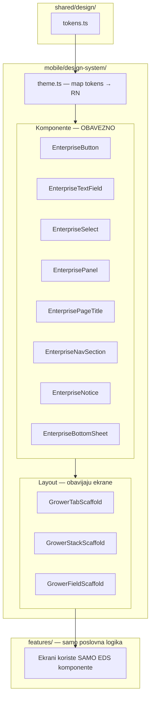

# Bio Vera Mobile — Enterprise Design System (EDS)

**Verzija:** 1.0 (implementirano u kodu)  
**Datum:** 2026-05-30  
**As-built arhitektura:** [MOBILE_ARCHITECTURE.md](./MOBILE_ARCHITECTURE.md)  
**Import:** `import { ... } from '@/design-system'`

---

## 1. Suština

Enterprise arhitektura mobilne aplikacije **nije** folder struktura niti scaffold.  
To je **kompletan set komponenti** — dugme, polje, panel, naslov — identičan web grower portalu (`Premium.tsx`, `premium-classes.ts`).

### Trenutno stanje (zašto app izgleda „jada“)

| Web | Mobile danas |
|-----|--------------|
| `<PremiumButton variant="primary">` | `TouchableOpacity` + `enterpriseUi.buttonPrimary` style **ili** legacy `Button.tsx` + `theme.ts` |
| `<input className="rounded-lg min-h-[48px] focus:ring-[#2D5A27]">` | `<TextInput style={growerUi.formInput} />` — **40+ mesta**, bez label/error/focus komponente |
| `<PremiumCard>` | `View style={enterpriseUi.inAppPanel}` — inline, nekonzistentno |
| `<PremiumPageTitle>` | inline `fontSize: 22, fontWeight: '600'` na hub tabovima |
| Jedan CSS token fajl | `theme.ts` + `enterprise-ui.ts` + `grower-ui.ts` + inline hex |

**Problem:** imate **StyleSheet objekte**, ne **React komponente**.  
Svaki developer lepi stilove na `TextInput` i `TouchableOpacity` drugačije → app nema enterprise osećaj.

### Cilj

```
features/grower/**  →  import { EnterpriseButton, EnterpriseTextField, EnterprisePanel } from '@/design-system'
features/grower/**  →  ZABRANJENO: TextInput, TouchableOpacity za UI, growerUi.formInput, theme.ts
```

---

## 2. Arhitektura slojeva



**Redosled implementacije:**  
1) tokeni → 2) **komponente (dugmad, polja, paneli)** → 3) layout scaffold → 4) migracija ekrana.

---

## 3. Design tokeni (shared sa webom)

**Fajl:** `shared/design/tokens.ts`  
**Web referenca:** `web/app/globals.css`, `web/lib/premium-classes.ts`

### 3.1 Boje

| Token | Hex | Web | Upotreba |
|-------|-----|-----|----------|
| `primary` | `#2D5A27` | `--color-vera` | CTA, fokus, akcent |
| `primaryHover` | `#23471f` | `--color-vera-hover` | pressed / hover |
| `canvas` | `#f6f5f1` | `--premium-page` | pozadina ekrana |
| `surface` | `#ffffff` | `--premium-surface` | paneli, kartice |
| `border` | `#e5e2db` | `--premium-border` | ivice panela |
| `borderNeutral` | `#E5E7EB` | gray-200 | unutrašnji divideri |
| `tint` | `#f7faf6` | inline grower | certified, notice |
| `muted` | `#6b7280` | `--premium-muted` | sekundarni tekst |
| `foreground` | `#171717` | `--foreground` | primarni tekst |
| `destructive` | `#991B1B` | — | error tekst (ne crveni paneli) |
| `wash` | `rgba(45,90,39,0.07)` | radial gradient | top aura |

### 3.2 Radius

| Token | px | Web |
|-------|-----|-----|
| `sm` | 8 | rounded-lg |
| `md` | 12 | rounded-xl (inputs, buttons) |
| `lg` | 16 | rounded-xl (section cards) |
| `2xl` | 24 | rounded-2xl (premium cards) |

### 3.3 Touch

| Token | px | Kontekst |
|-------|-----|----------|
| `min` | 44 | minimum tap (a11y) |
| `cta` | 48 | standard enterprise CTA |
| `farmer` | 56 | terenski mod (scanner, field-log) |

### 3.4 Tipografija

| Token | size | weight | Web |
|-------|------|--------|-----|
| `pageTitle` | 28 | 300–400 | `text-3xl font-light` |
| `sectionTitle` | 17 | 500 | nav row title |
| `body` | 15 | 400 | text-base |
| `caption` | 13 | 400–500 | labels, hints |
| `eyebrow` | 11 | 600 | uppercase tracking |

---

## 4. Katalog komponenti — specifikacija

Svaka komponenta ima: **variante, veličine, stanja, web paritet, API**.

---

### 4.1 `EnterpriseButton`

**Web paritet:** `PremiumButton`, `PremiumButtonLink`  
**Zamenjuje:** `components/ui/Button.tsx`, `TouchableOpacity` + `enterpriseUi.buttonPrimary`, `EnterpriseSettingsButton` (djelimično)

#### Variante

| Variant | Izgled | Web |
|---------|--------|-----|
| `primary` | fill `#2D5A27`, beli tekst, shadow | `premiumBtnPrimary` |
| `secondary` | belo, border `#d8d4cb`, hover tint | `premiumBtnSecondary` |
| `outline` | belo, border 2px `#2D5A27`, zeleni tekst | grower outline |
| `ghost` | transparent, zeleni tekst | — |
| `danger` | belo, border `#FECACA`, crveni tekst | destructive outline |

#### Veličine

| Size | minHeight | fontSize | Kontekst |
|------|-----------|----------|----------|
| `default` | 48 | 15 | standard |
| `large` | 52 | 16 | auth submit |
| `farmer` | 56 | 17 | teren |

#### Stanja

- `loading` → `ActivityIndicator`, disabled
- `disabled` → opacity 0.5
- `pressed` → `primaryHover` fill
- `fullWidth` → 100%

#### API (cilj)

```tsx
<EnterpriseButton
  variant="primary"
  size="default"
  label={t('common.save')}
  onPress={handleSave}
  loading={saving}
  fullWidth
  icon={<Save size={18} color="#fff" />}
/>
```

#### Pravila

- **Nikad** `TouchableOpacity` + custom style za akciju u grower feature-u
- Primary CTA na dnu forme: `fullWidth`, `size="default"` ili `"farmer"`
- Sekundarna akcija pored primarne: `variant="secondary"`

---

### 4.2 `EnterpriseTextField`

**Web paritet:** `<input className="rounded-lg border-gray-300 min-h-[48px] focus:ring-[#2D5A27]/25">`  
**Zamenjuje:** `<TextInput style={growerUi.formInput} />` (**glavni uzrok lošeg UX-a**)

#### Anatomija

```
┌─ EnterpriseFormField ─────────────────────┐
│  LABEL (caption, uppercase optional)      │
│  ┌─────────────────────────────────────┐  │
│  │  TextInput — enterprise surface     │  │
│  └─────────────────────────────────────┘  │
│  hint text (caption, muted)               │
│  error text (caption, destructive)        │
└───────────────────────────────────────────┘
```

#### Spec

| Svojstvo | Vrednost |
|----------|----------|
| minHeight | 48px (farmer: 56px) |
| borderRadius | 12 (`md`) |
| border | 1px `#E5E7EB` default |
| border focused | 2px `#2D5A27` |
| padding | 14px horizontal |
| fontSize | 16 (farmer: 17) — RN keyboard friendly |
| background | `#ffffff` |
| placeholder | `#6b7280` |
| label | 14px, weight 500, `#374151` |

#### API

```tsx
<EnterpriseTextField
  label={t('estates.form.name')}
  value={name}
  onChangeText={setName}
  placeholder={t('estates.form.namePlaceholder')}
  hint={t('estates.form.nameHint')}
  error={errors.name}
  required
  size="default"        // | "farmer"
  keyboardType="default"
  autoCapitalize="words"
/>
```

#### Varijante

| Variant | Opis |
|---------|------|
| `default` | standard text |
| `password` | secureTextEntry + toggle icon |
| `numeric` | keyboardType numeric, tabular nums |
| `multiline` | → `EnterpriseTextArea` (minRows 3) |

#### Pravila

- **Zabrana** raw `TextInput` u `features/grower/**`
- Error se prikazuje **ispod polja**, ne Alert
- Focus ring simulacija: border 2px green (RN nema ring — border je ekvivalent)

---

### 4.3 `EnterpriseTextArea`

**Web paritet:** `<textarea className="rounded-lg ... min-h-[120px]">`

```tsx
<EnterpriseTextArea
  label={t('growth.notes')}
  value={notes}
  onChangeText={setNotes}
  minRows={3}
  maxLength={500}
  showCount
/>
```

Isti tokeni kao TextField; `minHeight: 120`, vertical align top.

---

### 4.4 `EnterpriseSelect`

**Web paritet:** grower `<select>` / custom dropdown na webu  
**Postoji:** `GrowerSelectField` — **premestiti u design-system**, preimenovati, uskladiti trigger sa TextField

#### Spec trigger-a

Identičan `EnterpriseTextField` — ista visina, border, chevron desno.  
Picker otvara `EnterpriseBottomSheet` sa listom.

```tsx
<EnterpriseSelect
  label={t('plantings.crop')}
  value={cropId}
  options={crops}
  onSelect={setCropId}
  placeholder={t('common.select')}
  searchable
/>
```

---

### 4.5 `EnterpriseCheckbox` / `EnterpriseSwitch`

**Postoji:** `EnterpriseSettingsToggleRow` — generalizovati.

```tsx
<EnterpriseSwitch
  label={t('settings.notifications')}
  description={t('settings.notificationsDesc')}
  value={enabled}
  onValueChange={setEnabled}
/>
```

Switch track: `{ false: gray200, true: primary }` — već u settings.

---

### 4.6 `EnterprisePanel`

**Web paritet:** `PremiumCard`, section card `rounded-xl border-gray-200 bg-white shadow-sm p-5`

#### Varijante

| Variant | Izgled | Kada |
|---------|--------|------|
| `default` | beli, border `#e5e2db`, radius 16, blaga senka | liste, forme, sekcije |
| `premium` | radius 20, jača senka | KPI, stat kartice |
| `flat` | beli, border, bez senke | unutar panela |
| `tint` | bg `#f7faf6`, border green/15 | **retko** — certified, next step |

```tsx
<EnterprisePanel variant="default" padding="md">
  {children}
</EnterprisePanel>
```

**Zabrana:** `View style={enterpriseUi.inAppPanel}` inline u feature-ima.

---

### 4.7 `EnterpriseAccentPanel`

**Web paritet:** `PremiumAccentPanel` — green gradient panel  
**Pravilo:** max **1 po ekranu** (ribbon, next action). Vidi `MOBILE_SCROLL_BUDGET.md`.

```tsx
<EnterpriseAccentPanel>
  <EnterprisePageTitle eyebrow="Vera Standard" title="..." />
</EnterpriseAccentPanel>
```

Postojeći: `BioVeraProvenanceRibbon` → refactor na ovu komponentu.

---

### 4.8 `EnterprisePageTitle`

**Web paritet:** `PremiumPageTitle`

```tsx
<EnterprisePageTitle
  eyebrow={t('producer.hubs.field.eyebrow')}  // optional
  title={t('producer.hubs.field.screenTitle')}
  description={t('producer.hubs.field.screenSubtitle')}
  right={<EnterpriseButton variant="ghost" label="..." />}
/>
```

| Element | Spec |
|---------|------|
| eyebrow | 11px uppercase tracking, `#2D5A27` |
| title | 28px, weight 300–400, `#111827` |
| description | 15px, weight 400, `#6b7280`, max 3 lines |

**Zabrana:** inline `fontSize: 22, fontWeight: '600'` naslovi.

---

### 4.9 `EnterpriseNavSection` + `EnterpriseListRow`

**Web paritet:** `GrowerDashboardHomeWorkflow` tiles  
**Postoji:** `EnterpriseNavSection` — **zadržati**, dodati `EnterpriseListRow` kao exportovana komponenta.

```tsx
<EnterpriseNavSection
  title={t('producer.hubs.field.workflowTitle')}
  items={[
    { key: 'estates', icon: Home, title: '...', subtitle: '...', onPress: () => ... },
  ]}
/>
```

| Element | Spec |
|---------|------|
| row minHeight | 72–76px |
| icon box | 40×40, radius 10, white, border (NE krug 44px) |
| title | 17px weight 500 |
| subtitle | 14px muted |
| divider | hairline `#E5E7EB` |

---

### 4.10 `EnterpriseStatCard`

**Web paritet:** `PremiumStatCard`

```tsx
<EnterpriseStatCard
  label={t('dashboard.estates')}
  value={estateCount}
  icon={<Home size={20} color="#2D5A27" />}
/>
```

Label 14px medium gray; value 26–28px light tabular-nums.

---

### 4.11 `EnterpriseNotice`

**Web paritet:** inline alert na grower stranicama (tint panel, ne crveni banner)  
**Postoji:** `EnterpriseNotice` — standardizovati variant prop.

| Variant | Bg | Border | Tekst |
|---------|-----|--------|-------|
| `info` | `#f7faf6` | green/15 | `#23471f` |
| `warning` | `#FFFBEB` | amber/20 | `#92400E` — samo na stack ekranima |
| `error` | white | `#FECACA` | `#991B1B` |
| `offline` | `#f7faf6` | green/15 | sync poruka |

---

### 4.12 `EnterpriseFilterChip`

**Postoji u:** `growerUi.filterChip` — izvući u komponentu.

```tsx
<EnterpriseFilterChip label="Sve" selected={filter === 'all'} onPress={() => setFilter('all')} />
```

minHeight 48, radius 12, selected = primary tint border.

---

### 4.13 `EnterpriseBottomSheet`

**Postoji:** `BioVeraBottomSheet` — preimenovati / re-export.  
Koristi se za: select, add material, growth log modal.

---

### 4.14 `EnterpriseForm`

Kompozicija forme — **panel + field stack + footer actions**.

```tsx
<EnterpriseForm
  title={t('plantings.add')}
  onSubmit={handleSubmit}
  submitLabel={t('common.save')}
  loading={saving}
>
  <EnterpriseTextField ... />
  <EnterpriseSelect ... />
  <EnterpriseTextArea ... />
</EnterpriseForm>
```

- Polja automatski `marginBottom: 16`
- Submit: `EnterpriseButton primary fullWidth` fiksiran na dnu ili posle polja
- Cancel: `secondary` iznad submit

---

### 4.15 Layout komponente (obavijaju sadržaj)

| Komponenta | Sadržaj | Koristi EDS |
|------------|---------|-------------|
| `GrowerTabScaffold` | canvas + wash + refresh + PageTitle slot | da |
| `GrowerStackScaffold` | header + scroll + optional sticky footer CTA | da |
| `GrowerFieldScaffold` | isto + `size="farmer"` na svim poljima/dugmadima | da |
| `AuthScaffold` | AuthScreenShell + AuthPanel → refactor na EDS Panel | da |

---

## 5. Web ↔ Mobile mapa komponenti

| Web | Mobile EDS | Status |
|-----|------------|--------|
| `PremiumButton` | `EnterpriseButton` | **TODO** |
| `PremiumButtonLink` | `EnterpriseButton` + `href` prop / router | TODO |
| `PremiumCard` | `EnterprisePanel variant="premium"` | TODO |
| section card | `EnterprisePanel variant="default"` | style only |
| `PremiumAccentPanel` | `EnterpriseAccentPanel` | delimično (ribbon) |
| `PremiumPageTitle` | `EnterprisePageTitle` | TODO |
| `PremiumStatCard` | `EnterpriseStatCard` | TODO |
| `PremiumEyebrow` | deo PageTitle | TODO |
| `<input>` | `EnterpriseTextField` | **TODO — kritično** |
| `<textarea>` | `EnterpriseTextArea` | TODO |
| `<select>` | `EnterpriseSelect` | delimično (GrowerSelectField) |
| grower workflow tile | `EnterpriseNavSection` | postoji |
| settings toggle | `EnterpriseSwitch` | delimično |
| `SidebarLayout` | tab bar + `GrowerTabScaffold` | TODO |

---

## 6. Folder struktura

```
mobile/design-system/
├── index.ts                    # export svega
├── theme.ts                    # tokens → StyleSheet helpers
├── tokens.ts                   # re-export shared/design/tokens
│
├── EnterpriseButton.tsx
├── EnterpriseTextField.tsx
├── EnterpriseTextArea.tsx
├── EnterpriseSelect.tsx
├── EnterpriseSwitch.tsx
├── EnterprisePanel.tsx
├── EnterpriseAccentPanel.tsx
├── EnterprisePageTitle.tsx
├── EnterpriseNavSection.tsx      # migrate from components/enterprise/
├── EnterpriseStatCard.tsx
├── EnterpriseNotice.tsx
├── EnterpriseFilterChip.tsx
├── EnterpriseBottomSheet.tsx     # migrate BioVeraBottomSheet
├── EnterpriseForm.tsx
│
├── scaffolds/
│   ├── GrowerTabScaffold.tsx
│   ├── GrowerStackScaffold.tsx
│   ├── GrowerFieldScaffold.tsx
│   └── AuthScaffold.tsx
│
└── __tests__/                    # snapshot + a11y min height
```

**Deprecirati:**
- `components/ui/Button.tsx`
- `components/ui/Card.tsx`
- `growerUi.formInput` kao direktan stil na TextInput
- `enterpriseUi.buttonPrimary` kao copy-paste na TouchableOpacity

**Zadržati privremeno:** `enterprise-ui.ts` — interno koristi ga design-system, features ne importuju direktno.

---

## 7. Pravila enforced (CI + code review)

```text
features/grower/**
  ❌ import TextInput from 'react-native'        → koristi EnterpriseTextField
  ❌ import TouchableOpacity za CTA/dugme        → koristi EnterpriseButton
  ❌ import theme from '@/lib/theme'
  ❌ growerUi.formInput na TextInput
  ❌ hex literal (#xxx) u TSX
  ❌ fontWeight '600' na page title
  ✅ import from '@/design-system'
```

---

## 8. Primer — forma pre i posle

### Pre (loše — danas)

```tsx
<View style={growerUi.formPanel}>
  <Text style={growerUi.formLabel}>{t('estates.name')}</Text>
  <TextInput
    style={growerUi.formInput}
    value={name}
    onChangeText={setName}
  />
  <TouchableOpacity style={growerUi.btnPrimary} onPress={save}>
    <Text style={growerUi.btnPrimaryText}>{t('common.save')}</Text>
  </TouchableOpacity>
</View>
```

### Posle (enterprise)

```tsx
<EnterpriseForm title={t('estates.new')} onSubmit={save} submitLabel={t('common.save')} loading={saving}>
  <EnterpriseTextField
    label={t('estates.name')}
    value={name}
    onChangeText={setName}
    required
  />
</EnterpriseForm>
```

---

## 9. Plan implementacije

### Faza 1 — Komponente (3–4 dana) ← **START OVDE**

| Prioritet | Komponenta | Razlog |
|-----------|------------|--------|
| P0 | `EnterpriseButton` | svuda CTA |
| P0 | `EnterpriseTextField` | 40+ raw TextInput |
| P0 | `EnterprisePanel` | sve sekcije |
| P0 | `EnterprisePageTitle` | hub tabovi, stack header |
| P1 | `EnterpriseSelect` | refactor GrowerSelectField |
| P1 | `EnterpriseTextArea` | notes, opisi |
| P1 | `EnterpriseForm` | wizards |
| P2 | `EnterpriseStatCard`, `EnterpriseNotice`, `EnterpriseFilterChip` | dashboard |

### Faza 2 — Pilot ekrani (2 dana)

Migrirati **jedan ekran od svakog tipa** kao referenca:

| Ekran | Komponente |
|-------|------------|
| Field hub tab | PageTitle + NavSection + TabScaffold |
| `estates/new` | Form + TextField + Button |
| `materials` | Panel + List + BottomSheet |
| `login` | AuthScaffold + TextField + Button |
| `field-log` | FieldScaffold + farmer size |

### Faza 3 — Migracija po domenu (2 nedelje)

1. Forme: plantings, seed-registration, cost-calculator, growth-journal  
2. Liste: batches, orders, missions, estates  
3. Buyer/supplier — odvojen `BuyerButton` / `BuyerPanel` ako treba retail ton

### Faza 4 — Shared tokens sa webom

`shared/design/tokens.ts` → web build script za CSS vars (opciono).

---

## 10. Farmer mod (terenski)

Isti komponente, drugi `size`:

```tsx
<GrowerFieldScaffold title={t('scanner.title')}>
  <EnterpriseButton size="farmer" variant="primary" ... />
  <EnterpriseTextField size="farmer" ... />
</GrowerFieldScaffold>
```

| Element | default | farmer |
|---------|---------|--------|
| Button height | 48 | 56 |
| Input height | 48 | 56 |
| Body font | 15–16 | 17–18 |
| Icon | 20 | 24 |

Vizuelni jezik **ostaje enterprise** — samo veći touch, ne drugačije boje.

---

## 11. Metrike uspeha

| Metrika | Sada | Cilj |
|---------|------|------|
| Raw `TextInput` u grower features | ~45 | 0 |
| Raw `TouchableOpacity` kao dugme u grower | ~80 | 0 |
| Ekrani sa `EnterprisePageTitle` | ~3 | svi grower |
| `components/ui/Button` usage | buyer + legacy | 0 grower |
| Web screenshot parity (form + button) | ne | da |

---

## 12. Povezani dokumenti

| Dokument | Uloga |
|----------|-------|
| **Ovaj dokument (EDS)** | **kanonski** — komponente, polja, dugmad |
| [MOBILE_SCROLL_BUDGET.md](./MOBILE_SCROLL_BUDGET.md) | premium surface budget |
| [GROWER_NAV.md](./GROWER_NAV.md) | navigacija |
| [ARCHITECTURE.md](../../docs/ARCHITECTURE.md) | monorepo |
| `web/lib/premium-classes.ts` | web referenca |
| `web/components/ui/Premium.tsx` | web komponente |

---

## 13. Zaključak

Enterprise arhitektura = **svaki UI element je imenovana komponenta sa web paritetom**:

- dugme → `EnterpriseButton`
- polje → `EnterpriseTextField`
- panel → `EnterprisePanel`
- naslov → `EnterprisePageTitle`
- navigacija → `EnterpriseNavSection`

Bez toga, scaffold i tokeni ne pomažu — developer i dalje lepi `TextInput` sa random stilom.

**Prvi korak:** implementirati `EnterpriseButton` + `EnterpriseTextField` + `EnterprisePanel` + `EnterprisePageTitle`, pa migrirati Field hub i `estates/new` kao dokaz.

---

*EDS v1.0 — ažurirati kad se doda nova komponenta u katalog.*
