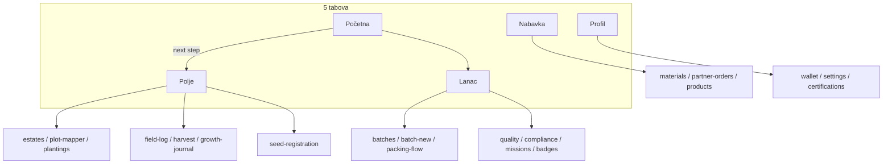

# Grower mobile — mapa navigacije

**Ažurirano:** 2026-05-25  
**Scope:** `mobile/app/(producer)/` + `features/grower/`  
**IA plan:** `docs/GROWER_MOBILE_IA_REDESIGN.md`

---

## 5 tabova (donji meni)

| # | Tab | Ruta | Hub fajl | Svrha |
|---|-----|------|----------|--------|
| 1 | Početna | `(tabs)/index` | `features/grower/dashboard/DashboardScreen.tsx` | Sledeći korak, KPI, snapshot |
| 2 | Polje | `(tabs)/field` | `features/grower/hubs/FieldHubScreen.tsx` | Rad na njivi (korak po korak) |
| 3 | Lanac | `(tabs)/chain` | `features/grower/hubs/ChainHubScreen.tsx` | Posle žetve → isporuka |
| 4 | Nabavka | `(tabs)/supplies` | `features/grower/hubs/SuppliesHubScreen.tsx` | Materijali, partneri, proizvodi |
| 5 | Profil | `(tabs)/profile` | `features/grower/profile/ProducerProfileScreen.tsx` | Nalog, novčanik, usklađenost |

Tab bar filter: `GrowerTabBar.tsx` — samo gornjih 5 ruta.

---

## Farmer workflow

### Polje (9 koraka)

| # | Korak | Ruta |
|---|--------|------|
| 1 | Gazdinstva | `/(producer)/estates` |
| 2 | Parcele | `/(producer)/estates` |
| 3 | Registracija semena | `/(producer)/seed-registration` |
| 4 | Mapa parcele | `/(producer)/plot-mapper` |
| 5 | Zasadi | `/(producer)/plantings` |
| 6 | Dnevnik rada | `/(producer)/(tabs)/field-log` |
| 7 | Vera torba | `/(producer)/vera-bag` |
| 8 | Dnevnik rasta | `/(producer)/growth-journal` |
| 9 | Žetva | `/(producer)/(tabs)/harvest` |

### Nabavka (5 koraka)

| # | Korak | Ruta |
|---|--------|------|
| 1 | Mapa snabdevača | `/map` |
| 2 | Materijali | `/(producer)/materials` |
| 3 | Partner porudžbine | `/(producer)/partner-orders` |
| 4 | Moji proizvodi | `/(producer)/(tabs)/products` |
| 5 | Kalkulator troškova | `/(producer)/(tabs)/cost-calculator` |

### Lanac (7 koraka)

| # | Korak | Ruta |
|---|--------|------|
| 1 | Lotovi | `/(producer)/batches` |
| 2 | Novi lot | `/(producer)/batch-new` |
| 3 | Pakovanje | `/(producer)/packing-flow` |
| 4 | Kvalitet | `/(producer)/quality-entry` |
| 5 | Usklađenost foto | `/(producer)/compliance-photos` |
| 6 | Prevoz | `/(producer)/missions` |
| 7 | Nalepnice | `/(producer)/package-badges` |

---

## Legacy redirect rute

| Ruta | Ponašanje | Razlog |
|------|-----------|--------|
| `(tabs)/wallet` | → `/(producer)/wallet` | Stack wallet za ispravan „nazad“ |
| `quality-entry` fallback | → supplies tab | Umesto shop redirecta |

---

## Provider redosled (`_layout.tsx`)

```
NetworkProvider → WalletProvider → GrowerDashboardProvider
```

Wallet je spolja da `useDashboardData` može pozvati `reloadWallet()` na pull-to-refresh bez duplog `/wallets/me` fetcha u dashboardu.

---

## Dijagram



---

## Skriveni tabovi (`href: null`)

| Ruta | Ekran | Ko otvara |
|------|-------|-----------|
| `steps` | `GrowerJourneyScreen` | Početna next-step, journey link |
| `products` | `ProductsScreen` | Nabavka hub |
| `cost-calculator` | `CostCalculatorScreen` | Nabavka hub |
| `field-log` | `FieldLogScreen` | Polje hub |
| `harvest` | `HarvestScreen` | Polje hub |
| `settings` | `SettingsScreen` | Profil |
| `certifications` | `CertificationsScreen` | Profil → Usklađenost |
| `banned-substances` | `BannedSubstancesScreen` | Profil → Usklađenost |
| `wallet` | Redirect → `/(producer)/wallet` | Legacy tab path |

---

## Stack ekrani (van tabova)

| Faza | Rute |
|------|------|
| **Polje** | `estates`, `estates/new`, `estates/[id]`, `estates/[id]/edit`, `plot-mapper`, `plantings`, `growth-journal` |
| **Lanac** | `batches`, `batch-new`, `batch/[id]`, `packing-flow`, `quality-entry`, `compliance-photos`, `missions`, `missions-create`, `mission/[id]`, `package-badges`, `scanner` |
| **Nabavka** | `materials`, `partner-orders`, `partner-order/[orderId]` |
| **Profil** | `wallet`, `notifications`, `education`, `vera-insights`, `app-guide`, `orders`, `orders/[id]` |
| **Polje** | `vera-bag` (foto dokazi) |
| **Legacy** | `farm-tools` (redirect ka hubovima), `orders` |

---

## Globalne rute (van producer shell-a)

| Ruta | Napomena |
|------|----------|
| `/(producer)/seed-registration` | Seme — Polje korak 3 (AuthGuard + offline) |
| `/seed-registration` | Legacy redirect → producer route |
| `/map`, `/supplier-map` | Mapa dobavljača — Nabavka |
| `/scan-qr` | QR sken |
| `/b2b-supplier/[userId]` | Prodavnica partnera |

---

## Konteksti

| Context | Podaci | Potrošači |
|---------|--------|-----------|
| `GrowerDashboardContext` | Parcele, lotovi, misije, offline queue, notifikacije | Početna, hubovi, refresh |
| `WalletContext` | Balance, transakcije, ordersFinancial | WalletScreen, Profil, Početna KPI |
| `NetworkContext` | Online/offline | Offline strip, sync |

---

## Orphan / legacy (poznato)

| Stavka | Status |
|--------|--------|
| `BatchesListScreen.tsx` | Obrisano — koristi `BatchesScreen` |
| `FarmerHomeSection.tsx` | Obrisano — zamenjeno hubovima |
| `QuickAccessGrid` duplikati | Svedeno — hub je primarni ulaz |
| `SuppliesHubOrdersPreview.tsx` | Obrisano — zamenjeno workflow karticama |
| `(tabs)/shop` | Obrisano — nema referenci u kodu |
| `vera-bag`, `vera-insights` | Povezano — Polje hub / Profil više |
| Dupli wallet fetch | Rešeno — `WalletContext` jedini izvor; dashboard refresh zove `reloadWallet()` |

---

## Pravilo za nove ekrane

**Svaki stack ekran = tačno jedan ulaz** iz odgovarajućeg tab hub-a (ili Početna next-step / notifikacija).
