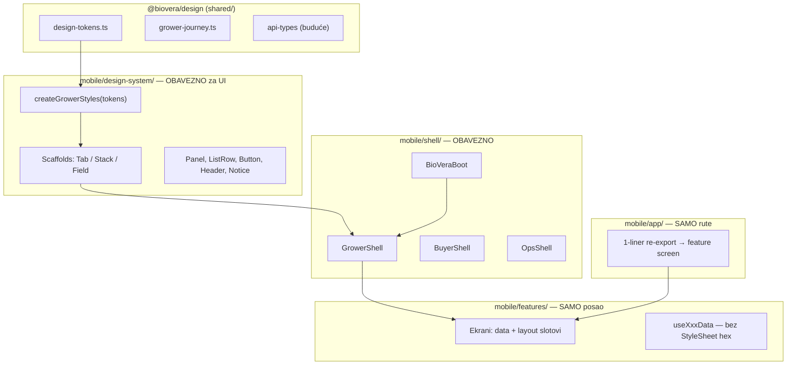

# Bio Vera Mobile — arhitektura v2 (temeljna reorganizacija)

**Datum:** 2026-05-30  
**Status:** dopunjeno — **kanonski UI dokument je [ENTERPRISE_DESIGN_SYSTEM.md](./ENTERPRISE_DESIGN_SYSTEM.md)**  
**Cilj:** mobilna aplikacija mora da izgleda i ponaša se kao **isti proizvod** kao web grower portal.

> **v2 scaffold/token sloj** ostaje validan za boot i navigaciju.  
> **EDS (Enterprise Design System)** definiše dugmad, polja, panele — to je ono što korisnik vidi i oseća kao enterprise.

---

## Zašto v1 nije dovoljan

v1 predlog („hub tabovi na `EnterpriseScreen`“) lepi flaster na **strukturni problem**:

| Simptom | Pravi uzrok |
|---------|-------------|
| Hub tabovi izgledaju jeftino | **Nema obaveznog scaffold-a** — developer bira `theme` ili `enterprise` |
| Splash → welcome → home flash | **Root `_layout.tsx` koristi `theme.ts`**, ne enterprise — app se rađa u legacy modu |
| 3 headera | **Nema jedne navigacione abstrakcije** — svaki ekran inventuje chrome |
| Web enterprise, mobile ne | **Nema shared design paketa** — dva nezavisna CSS/StyleSheet sveta |
| 100+ grower fajlova na `theme.ts` | **Design system nije gate** — samo opcioni import |
| 93 `app/` rute, duplikati | **Routing nije registry** — `seed-registration` na root i u `(producer)` |

**Zaključak:** ne treba još 5 komponenti u `components/enterprise/`. Treba **nova folder struktura + obavezna pravila + shared tokeni** — onda UI pada na mesto sam.

---

## Cilj: tri sloja, jedan izlaz



**Pravilo:** `features/` **ne sme** importovati `theme.ts` niti pisati `backgroundColor: '#fff'`.  
Sve ide kroz `design-system/` scaffold + primitives.

---

## 1. Shared paket: `@biovera/design`

Jedan fajl, dva potrošača (web generiše CSS vars, mobile generiše StyleSheet).

```
shared/
  design/
    tokens.ts          ← jedini izvor hex/radius/type
    grower-surfaces.ts ← semantika: canvas, panel, tint, destructive
    index.ts
```

### `tokens.ts` (sinhron sa web `globals.css`)

```ts
export const vera = {
  color: {
    primary: '#2D5A27',
    primaryHover: '#23471f',
    canvas: '#f6f5f1',        // web --premium-page
    surface: '#ffffff',
    border: '#e5e2db',        // web --premium-border
    borderNeutral: '#E5E7EB',
    tint: '#f7faf6',          // certified / notice
    muted: '#6b7280',
    foreground: '#171717',
    wash: 'rgba(45, 90, 39, 0.07)',
  },
  radius: { sm: 8, md: 12, lg: 16, xl: 20, '2xl': 24 },
  touch: { min: 44, cta: 48, farmer: 56 },
  type: {
    body: 15,
    caption: 13,
    pageTitle: 28,
    sectionTitle: 17,
    weights: { light: '300', regular: '400', medium: '500', semibold: '600' },
  },
} as const;
```

**Web migracija (kasnije):** `globals.css` `--premium-page` → import iz `tokens.ts` build skriptom, ili ručno držati sync dok ne automatizujemo.

**Mobile:** `design-system/theme.ts` = `createStyleSheet(vera)` — **briše** duplikat u `lib/enterprise-ui.ts` + `lib/theme.ts` za grower put.

---

## 2. Nova folder struktura (mobile)

```
mobile/
├── app/                    # SAMO expo-router fajlovi (re-export)
├── shell/                  # NOVO — app lifecycle + role shells
│   ├── BioVeraBoot.tsx
│   ├── GrowerShell.tsx
│   ├── BuyerShell.tsx
│   └── navigation-theme.ts
├── design-system/          # NOVO — jedini UI sloj
│   ├── scaffolds/
│   │   GrowerTabScaffold.tsx
│   │   GrowerStackScaffold.tsx
│   │   GrowerFieldScaffold.tsx   # 56px CTAs, outdoor
│   │   AuthScaffold.tsx
│   ├── primitives/
│   │   Panel, ListRow, Button, PageTitle, Notice, BottomSheet
│   ├── theme.ts            # StyleSheet iz shared tokens
│   └── index.ts
├── features/               # poslovna logika (bez raw boja)
├── lib/                    # api, sync, i18n — BEZ ui tokena
└── components/             # DEPRECATED → migrirati u design-system/
```

### Deprecacija

| Staro | Novo |
|-------|------|
| `lib/theme.ts` (grower) | `design-system/theme.ts` |
| `lib/enterprise-ui.ts` | scaffolds + primitives |
| `lib/grower-ui.ts` | alias u `design-system` |
| `lib/home-ui.ts` | `GrowerTabScaffold` slot props |
| `components/enterprise/*` | `design-system/scaffolds + primitives` |
| `components/ui/Card.tsx` | `Panel` |

---

## 3. Scaffold sistem — **ne može se zaobići**

Umesto „koristi `EnterpriseScreen` kad stigneš“, svaki grower ekran **mora** biti jedan od 4 tipova:

### 3.1 `GrowerTabScaffold`

Za 5 tab root-ova. Enkapsulira:
- canvas `#f6f5f1` + top wash
- pull-to-refresh
- `PageTitle` (28px light) + `PageLead`
- `TabRootBody` padding
- **zabrana** custom ScrollView u feature-u

```tsx
// features/grower/hubs/FieldHubScreen.tsx — POSLE
export default function FieldHubScreen() {
  const { t } = useTranslation();
  const steps = useFieldHubSteps();

  return (
    <GrowerTabScaffold
      title={t('producer.hubs.field.screenTitle')}
      lead={t('producer.hubs.field.screenSubtitle')}
      statusLine={useFieldStatusLine()}
    >
      <NavSection items={steps} />
    </GrowerTabScaffold>
  );
}
```

Field / Chain / Supplies / Home / Profile — **isti scaffold**, različit sadržaj.

### 3.2 `GrowerStackScaffold`

Za stack workflow (batches, estates, materials…):
- `BioVeraHeader` (jedan tip!)
- canvas pozadina
- opcioni `stickyFooter` za primary CTA
- `headerMode: 'bar' | 'inline'`

### 3.3 `GrowerFieldScaffold`

Terenski mod (scanner, field-log, harvest):
- isti vizuelni jezik
- `touchScale: 'farmer'` → 56px dugmad, 18px+ body
- high contrast, manje dekoracije

### 3.4 `AuthScaffold`

Welcome, login, register — boot sekvenca.

---

## 4. Boot arhitektura — prvi utisak

Problem nije samo splash slika — **ceo app root je legacy**.

### Trenutno (`app/_layout.tsx`)

```tsx
import { theme } from '../lib/theme';  // ← beli header, legacy
```

### Cilj: `BioVeraBoot`

```tsx
// shell/BioVeraBoot.tsx
export function BioVeraBoot({ children }) {
  // 1. preventAutoHideAsync
  // 2. restore auth
  // 3. apply navigation theme (enterprise colors u native stack header)
  // 4. hideAsync kad je spremno
  // 5. optional: font preload
  return (
    <DesignTokensProvider tokens={vera}>
      <NavigationThemeProvider value={growerNavigationTheme}>
        {children}
      </NavigationThemeProvider>
    </DesignTokensProvider>
  );
}
```

**Splash asset:** pozadina `#f6f5f1`, ne `#FFFFFF`.  
**Native stack headeri** (retki): iz `navigation-theme.ts`, ne `theme.ts`.

---

## 5. Tri produktne površine (ne jedna app tema)

Web već ima razliku grower vs buyer. Mobile to meša u `theme.ts`.

| Površina | Shell | Canvas | Tipografija | Primer |
|----------|-------|--------|-------------|--------|
| **Grower** | `GrowerShell` | warm `#f6f5f1` | light titles | producer/* |
| **Buyer** | `BuyerShell` | white / retail | bolder shop | buyer/* |
| **Ops** | `OpsShell` | neutral gray | compact | logistics, supplier |

`GrowerShell` wrapuje `(producer)/_layout.tsx`:
- AuthGuard
- Network + Wallet + Dashboard providers
- offline strip
- **ne** meša buyer cart provider u grower context

---

## 6. Screen registry — routing kao podatak

Umesto 40+ ručno registrovanih `Stack.Screen` u `(producer)/_layout.tsx`:

```ts
// shell/grower-screen-registry.ts
export const growerScreens = [
  {
    id: 'field-hub',
    route: '/(producer)/(tabs)/field',
    webPath: '/grower/estates',
    scaffold: 'tab',
    feature: () => require('@/features/grower/hubs/FieldHubScreen'),
  },
  {
    id: 'batches',
    route: '/(producer)/batches',
    webPath: '/grower/batches',
    scaffold: 'stack',
    feature: () => require('@/features/grower/batches/BatchesScreen'),
  },
  // ...
] as const;
```

**Koristi:**
- generiše hub workflow (Field/Chain/Supplies) iz istog registry-ja
- parity matrica web ↔ mobile automatski
- `_layout.tsx` iterira registry umesto copy-paste
- i18n title keys u jednom mestu

---

## 7. Hub ekrani — jedan config, ne tri fajla

```ts
// features/grower/hubs/config/field.hub.ts
export const fieldHub: HubConfig = {
  titleKey: 'producer.hubs.field.screenTitle',
  leadKey: 'producer.hubs.field.screenSubtitle',
  statusKey: 'producer.hubs.field.leadShort',
  steps: fieldWorkflowSteps,  // sync sa web/lib/grower-nav redosled
};
```

```tsx
// features/grower/hubs/FieldHubScreen.tsx — 3 linije
export default function FieldHubScreen() {
  return <GrowerHub config={fieldHub} />;
}
```

`GrowerHub` = `GrowerTabScaffold` + `NavSection` + refresh iz `GrowerDashboardContext`.

**Web parity:** koraci u `field.hub.ts` moraju match-ovati `GrowerDashboardHomeWorkflow` redosled.

---

## 8. Enforcing — kako sprečiti regresiju

### 8.1 ESLint / grep gate (CI)

```text
features/grower/**  → zabrana importa iz lib/theme.ts
features/grower/**  → zabrana hex literal (#xxx) u TSX
app/_layout.tsx     → mora importovati shell/, ne theme.ts
```

### 8.2 Adapter za migraciju (ne big-bang)

Faza 0: `lib/theme.ts` za grower re-exportuje iz `design-system/theme.ts`:

```ts
// privremeno — theme.colors.primary i dalje radi, ali vrednosti su enterprise
export const theme = createLegacyThemeAdapter(vera);
```

100 fajlova **ne mora** odjednom — ali **novi** kod ide samo kroz scaffolds.

### 8.3 PR checklist

- [ ] Grower ekran koristi scaffold?
- [ ] Nema inline hex?
- [ ] Web path u registry?
- [ ] sr.json + en.json keys?

---

## 9. Vizuelni sistem — šta „enterprise open“ znači

Web grower **nije** flat white app. Mobile mora replicirati **4 sloja dubine**:

```
┌─────────────────────────────────────┐
│  radial wash (7% green, top)        │  ← GrowerTabScaffold withTopWash
│  ┌───────────────────────────────┐  │
│  │ canvas #f6f5f1                │  │  ← pozadina „diše“
│  │  ┌─────────────────────────┐  │  │
│  │  │ panel #fff              │  │  │  ← NavSection / inAppPanel
│  │  │ border #e5e2db          │  │  │
│  │  └─────────────────────────┘  │  │
│  │  ┌─ tint #f7faf6 ──────────┐  │  │  ← SAMO ribbon / next step
│  │  │ provenance / certified  │  │  │
│  │  └─────────────────────────┘  │  │
│  └───────────────────────────────┘  │
└─────────────────────────────────────┘
```

**Zabranjeno na tab root:**
- `#FFFFFF` full-screen background
- `fontWeight: '600'` na page title (koristi `'300'`/`'400'`)
- kružne icon bubble (koristi `rounded-lg` square kao web)
- rainbow status boje (plava/žuta) — samo gray + green + destructive text

---

## 10. Plan implementacije (realan, 2–3 nedelje)

### Nedelja 1 — Temelj (bez ovoga ništa drugo nema smisla)

| Dan | Deliverable |
|-----|-------------|
| 1 | `shared/design/tokens.ts` + mobile `design-system/theme.ts` |
| 2 | `BioVeraBoot` + splash `#f6f5f1` + root `_layout` na shell |
| 3 | `GrowerTabScaffold` + migriraj **Home** (već blizu) |
| 4 | `GrowerHub` + migriraj **Field** tab (pilot) |
| 5 | Chain + Supplies hub preko istog `GrowerHub` |

**Exit kriterijum nedelje 1:** screenshot Field tab pored web `/grower` — ista porodica boja.

### Nedelja 2 — Scaffold + header

| Dan | Deliverable |
|-----|-------------|
| 1–2 | `GrowerStackScaffold` + `BioVeraHeader` (spoji 3 postojeća) |
| 3 | Migriraj top 8 ekrana: estates, batches, materials, growth-journal, scanner, field-log, harvest, wallet |
| 4 | `grower-screen-registry.ts` + pojednostavi `(producer)/_layout.tsx` |
| 5 | ESLint grep gate u CI |

### Nedelja 3 — Poliranje + buyer

| Dan | Deliverable |
|-----|-------------|
| 1–3 | Ostali grower stack ekrani (batch migrira po korišćenju) |
| 4 | `BuyerShell` odvojeno (shop retail ton) |
| 5 | Obriši mrtav kod: `EnterpriseListPanel`, dupli `components/enterprise` posle migracije |

---

## 11. Metrike — „bolje“ merljivo

| Metrika | Sada | Cilj |
|---------|------|------|
| Grower feature fajlova na `theme.ts` | ~95 | 0 (adapter privremeno, pa 0) |
| Tab roots na scaffold | 2/5 | 5/5 |
| Header implementacije | 3 | 1 |
| Token izvora | 4 fajla + inline | 1 shared |
| Root layout na legacy theme | da | ne |
| Hub implementacija | 3× copy-paste | 1× `GrowerHub` |
| Regresija (hex u grower/features) | nema gate | CI fail |

---

## 12. Šta ovo menja u odnosu na v1

| v1 (flaster) | v2 (temelj) |
|--------------|-------------|
| „Stavi `EnterpriseScreen` na hub“ | **Scaffold obavezan** — ne može bez njega |
| „Uskladi hex u enterprise-ui.ts“ | **Shared tokens** web + mobile |
| „Spoji headere“ | **Jedan header u design-system** |
| „AppBootProvider“ | **BioVeraBoot menja root** — app se rađa enterprise |
| Ručna parity matrica | **Screen registry** |
| Migriraj 60 ekrana ručno | **Adapter + scaffold** — stari ekrani rade, novi izgled kroz wrapper |

---

## 13. Prvi commit (minimalni, odmah vidljiv)

Ako krenemo danas, prvi PR neka bude **samo ovo** (~400 LOC):

1. `shared/design/tokens.ts`
2. `mobile/design-system/theme.ts` (from tokens)
3. `mobile/shell/BioVeraBoot.tsx`
4. `mobile/design-system/scaffolds/GrowerTabScaffold.tsx`
5. `FieldHubScreen` → `GrowerHub` + `field.hub.ts`
6. Splash pozadina `#f6f5f1`
7. Root `_layout.tsx` → `BioVeraBoot` + navigation theme

**Jedan tab transformisan + boot fixed = korisnik odmah vidi da app „nije jadna“.**

---

## 14. Povezani dokumenti

| Dokument | Status |
|----------|--------|
| [ARCHITECTURE.md](../../docs/ARCHITECTURE.md) | ceo monorepo |
| [GROWER_NAV.md](./GROWER_NAV.md) | IA (ne menjati) |
| [MOBILE_SCROLL_BUDGET.md](./MOBILE_SCROLL_BUDGET.md) | premium surface pravila |
| MOBILE_ENTERPRISE_ARCHITECTURE_PROPOSAL.md (v1) | **zastareo** — referenca |

---

*Arhitektura v2: ne više komponenti — **obavezni sistem**. UI nije stvar ukusa developera, već prolaz kroz scaffold.*
