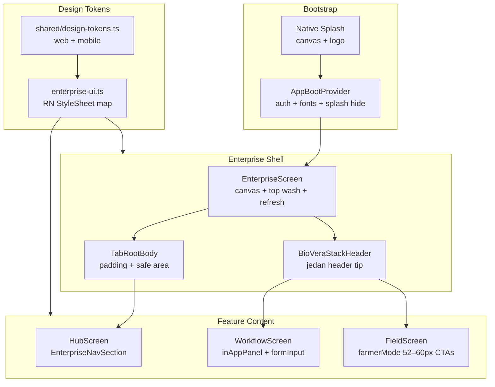
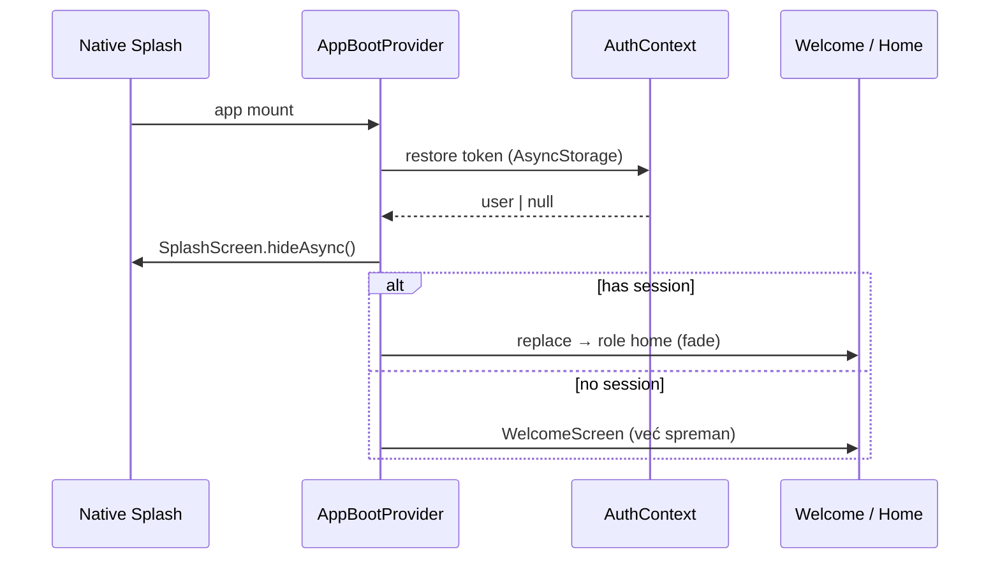

# Predlog arhitekture — mobilna aplikacija ↔ web enterprise (v1)

**Datum:** 2026-05-30  
**Status:** **zastareo** — vidi **[MOBILE_ARCHITECTURE_V2.md](./MOBILE_ARCHITECTURE_V2.md)** za temeljnu reorganizaciju  
**Cilj:** mobilna aplikacija mora da izgleda i ponaša se kao **isti proizvod** kao web grower portal — ne kao odvojena „jada“ aplikacija.

> v1 je bio inkrementalan (primeni shell na hub tabove). v2 uvodi obavezne scaffolds, shared tokens, BioVeraBoot i screen registry.

---

## 1. Dijagnoza — zašto trenutno deluje loše

### 1.1 Dva proizvoda u jednom repo-u

Web grower koristi **jedan vizuelni jezik**:
- topla canvas pozadina (`#f6f5f1`) + zeleni radial wash
- `font-light` naslovi, beli paneli sa `rounded-xl`, retki zeleni accent paneli
- `GrowerPageShell` → `PremiumCard` → `PremiumButton` (48px)

Mobilna aplikacija ima **enterprise sloj koji je napisan ali nije primenjen svuda**:

| Ekran / zona | Shell | Osećaj |
|--------------|-------|--------|
| Welcome, Login | `enterpriseUi.authCanvas` + gradient | ✅ enterprise |
| **Home tab** | `EnterpriseScreen` + `BioVeraProvenanceRibbon` | ✅ enterprise |
| **Profile tab** | `EnterpriseScreen` + `EnterpriseNavSection` | ✅ enterprise |
| **Field / Chain / Supplies hub** | raw `View` + `theme.ts` + inline stilovi | ❌ bela „app store“ kartica |
| ~40 stack ekrana | mešavina `GrowerStackHeader`, `BioVeraSubpageHeader`, `theme` | ⚠️ tri različita headera |
| Buyer shop | legacy `Card.tsx` + `theme` | ❌ retail, ne enterprise |

**Posledica:** korisnik otvori app → splash (beli) → welcome (enterprise) → uđe u Polje tab → **vizuelni šok** — bela pozadina, bold 22px naslov, kružne ikone, drugačiji border radius. Osećaj „beta“ aplikacije, ne Bio Vera enterprise.

### 1.2 Arhitektura tokena je podeljena

```
theme.ts          → legacy: rainbow status boje, #FFFFFF background, h1 weight 600
enterprise-ui.ts  → web-aligned: canvas #F9FAFB, light titles, gray-only status
grower-ui.ts      → alias preko enterprise
home-ui.ts        → samo dashboard
+ inline hex u 20+ fajlova
```

Web ima **jedan izvor istine**: `web/app/globals.css` + `web/lib/premium-classes.ts`.  
Mobile **nema** ekvivalent — i dokumentacija (`MOBILE_DESIGN_ALIGNMENT_WEB.md`) i dalje referencira nepostojeći `colors.ts`.

### 1.3 Splash → prvi ekran nema kontinuitet

| Korak | Šta se dešava |
|-------|---------------|
| Native splash | statična bela `#FFFFFF` + logo (`app.json`) |
| Welcome loading | `ActivityIndicator` na gray canvas |
| Welcome content | animirani gradient + tagline |
| Auto-login redirect | skok na Home bez tranzicije brenda |

Nema `expo-splash-screen` hide kad je auth spreman. Nema shared „boot sequence“. Korisnik vidi **3 različita first paint-a** pre nego što stigne na dashboard.

### 1.4 Navigaciona arhitektura je IA-refactor bez UI-refactora

Faze 0–8 (hub tabovi) su **logički** završene (`GROWER_NAV.md`), ali **UI sloj nije pratio**:
- hub ekrani su brzo napisani sa `theme` + copy-paste kartica
- `EnterpriseNavSection` / `EnterpriseListRow` postoje ali hubovi ih ne koriste
- `EnterpriseListPanel`, `BioVeraChainTraceStrip`, `BioVeraSignatureRule` — mrtav kod

### 1.5 Nema veze sa `shared/` dizajn sistemom

Web i mobile ne dele token fajl. Svaka promena boje na webu zahteva ručno traženje u mobile.

---

## 2. Ciljna arhitektura — jedan mobilni „enterprise shell“

### 2.1 Slojevi (od spolja ka unutra)



### 2.2 Pravilo: **jedan shell po tipu ekrana**

| Tip ekrana | Obavezni wrapper | Primer |
|------------|------------------|--------|
| **Tab root** (5 tabova) | `EnterpriseScreen` + `TabRootBody` | Home, Field, Chain, Supplies, Profile |
| **Hub lista** | `EnterpriseNavSection` + `EnterpriseListRow` | workflow koraci u hub-u |
| **Stack workflow** | `EnterpriseScreen` + `BioVeraStackHeader` | batches, estates, materials |
| **Auth / onboarding** | `AuthScreenShell` | login, register, welcome |
| **Farmer field mode** | `EnterpriseScreen` + `farmerMode` prop | scanner, field-log, harvest — veći touch targeti |
| **Buyer retail** | `BuyerScreenShell` (novo, odvojeno) | shop — druga vizuelna porodica, ali ista primary boja |

**Zabrana:** `theme.colors.background` (#FFFFFF full screen) na grower tab root-ovima.  
**Zabrana:** inline `style={{ fontSize: 22, fontWeight: '600' }}` — koristiti `enterpriseUi.inAppTitle`.

### 2.3 Jedan header sistem

Spojiti u **`BioVeraStackHeader`**:

| Trenutno | Status |
|----------|--------|
| `GrowerStackHeader` | beli bar, back chevron |
| `GrowerTabHeader` | title u scroll-u |
| `BioVeraSubpageHeader` | canvas + smart back |

**Cilj:** jedan komponent sa varijantama:
- `variant="stack"` — sticky beli bar (kao web sticky header)
- `variant="inline"` — naslov u sadržaju (kao `GrowerPageHeader`)
- `variant="minimal"` — samo back, bez bordera

Web referenca: `PremiumPageTitle` (eyebrow + light title + lead).

---

## 3. Design system — povezivanje sa webom

### 3.1 Novi shared token fajl

Kreirati **`shared/design-tokens.ts`** (ili `shared/lib/design-tokens.ts`):

```ts
export const veraTokens = {
  color: {
    primary: '#2D5A27',
    primaryHover: '#23471f',
    canvas: '#f6f5f1',           // web --premium-page (NE #F9FAFB)
    surface: '#ffffff',
    border: '#e5e2db',           // web --premium-border (NE #E5E7EB)
    borderNeutral: '#E5E7EB',
    tintBg: '#f7faf6',           // certified / notice panels
    muted: '#6b7280',
    foreground: '#171717',
  },
  radius: { sm: 8, md: 12, lg: 16, xl: 20, '2xl': 24 },
  touch: { min: 44, cta: 48, farmer: 52 },
  type: {
    body: 15,
    caption: 13,
    pageTitle: 28,   // font-light
    sectionTitle: 17,
  },
} as const;
```

**Web:** import u `premium-classes.ts` (postepeno).  
**Mobile:** `enterprise-ui.ts` mapira u `StyleSheet` — **jedan import, nema dupliranja hex**.

### 3.2 Vizuelna mapa web → mobile

| Web klasa / komponenta | Mobile ekvivalent | Akcija |
|------------------------|-------------------|--------|
| `.premium-page-bg` | `EnterpriseScreen` + `withTopWash` | canvas → `#f6f5f1`, jači radial wash |
| `PremiumCard` | `enterpriseUi.inAppPanel` | radius 16→20 (`rounded-2xl`) |
| `PremiumAccentPanel` | `enterpriseUi.premiumSurface` | **samo** ribbon / next-step |
| `PremiumButton` | `enterpriseUi.buttonPrimary` | 48px, radius 12 |
| `GrowerPageHeader` | `enterpriseUi.inAppTitle` + `inAppLead` | 28px light, ne 22px semibold |
| Workflow tile | `EnterpriseListRow` | 72px, square icon box (ne krug) |
| `#f7faf6` notice | `enterpriseColors.tintPanelBg` | dodati token |
| Active nav inset bar | tab bar active tint | već delimično |

### 3.3 „Otvorene boje“ — šta korisnik očekuje

Web **nije** flat bela aplikacija. Ima:
1. **Topla siva canvas** — prostor „diše“, nije `#FFFFFF` wall
2. **Zeleni wash** na vrhu — blaga premium aura
3. **Beli paneli** kao „kartice na stolu“ — kontrast prema canvas-u
4. **Retki zeleni tint** — samo za certified / provenance / next action

Mobile hubovi trenutno: **bela na beloj** + tamni bold naslovi = zatvoreno, jeftino.

**Fix:** svi tab root-ovi na `#f6f5f1` canvas; kartice `#FFFFFF` sa warm border `#e5e2db`; naslovi `fontWeight: '300'` ili `'400'`, ne `'600'`.

---

## 4. Bootstrap arhitektura — od splash-a do grower home

### 4.1 Ciljni tok



### 4.2 `AppBootProvider` (novi, u `app/_layout.tsx`)

Odgovornosti:
1. Drži native splash dok `AuthContext.loading === false`
2. Opciono: preload font (Geist via `@expo-google-fonts` ili sistem sa usklađenim težinama)
3. Jednom pozove `SplashScreen.preventAutoHideAsync()` na startu
4. Kad auth zna stanje → `SplashScreen.hideAsync()` + render children

**Splash asset:** regenerisati da pozadina bude `#f6f5f1` (ne `#FFFFFF`) — isti canvas kao welcome/home.

### 4.3 WelcomeScreen

Već enterprise — samo:
- ukloniti dupli loading spinner (boot provider rešava)
- dodati `FadeOut` pri redirect-u ka home
- uskladiti gradient sa novim canvas hex

---

## 5. Grower navigacija — arhitektura povezana sa web IA

### 5.1 Mapiranje tab ↔ web sidebar

| Mobile tab | Web grower sekcija | Hub sadržaj |
|------------|-------------------|-------------|
| Home | Dashboard | KPI, next step, farm snapshot (bez hub nav) |
| Polje | Estates, Field diary, Plantings, Harvest | workflow redosled |
| Lanac | Batches, Missions, Orders | lot → transport → isporuka |
| Nabavka | Materials, Seeds, Vera bag | nabavka inputa |
| Profil | Profile, Wallet, Settings | account + novčanik |

Web referenca: `web/lib/grower-nav.tsx` — **redosled stavki u hub-u mora pratiti web workflow**.

### 5.2 HubScreen kao shared komponenta

Umesto 3 copy-paste fajla (`FieldHubScreen`, `ChainHubScreen`, `SuppliesHubScreen`):

```
features/grower/hubs/
  GrowerHubScreen.tsx      ← generički: title, subtitle, statusLine, steps[]
  field-hub.config.ts      ← lista WorkflowStep + i18n keys
  chain-hub.config.ts
  supplies-hub.config.ts
  FieldHubScreen.tsx       ← tanak wrapper: config + GrowerHubScreen
```

**GrowerHubScreen** koristi:
- `EnterpriseScreen fillViewport withTopWash`
- `TabRootBody`
- `enterpriseUi.inAppTitle` / `inAppLead`
- `EnterpriseNavSection` sa `EnterpriseListRow` (square icon box `44×44 rounded-lg bg primary/10`)

Parity sa web: `GrowerDashboardHomeWorkflow.tsx`.

### 5.3 Stack rute — jedan registry

Centralizovati u `mobile/lib/grower-routes.ts`:
- path, i18n title key, web equivalent path, API endpoints used
- olakšava parity matricu iz `docs/WEB_MOBILE_CHANNEL_PARITY_PLAN.md`

---

## 6. API i data sloj — arhitektura povezivanja

UI refactor ne rešava backend vezu, ali mobilna arhitektura treba:

```
contexts/          ← Auth, Wallet, GrowerDashboard (jedan fetch po sesiji)
lib/api/           ← domain moduli (zadržati modularno)
lib/sync-service/  ← offline queue (jedan servis, ne po feature-u)
hooks/             ← useGrowerTabRefresh, useMaterialCompliance, …
features/*/        ← UI only; ne axios direktno u screen-u
```

**Pravilo:** ekran importuje hook ili context, ne `api.batches.get()` inline.

---

## 7. Fazni plan implementacije

### Faza A — Temelj (1–2 dana) — **bez ovoga sve ostalo propada**

| # | Task | Fajlovi |
|---|------|---------|
| A1 | `shared/design-tokens.ts` + mobile import | `shared/`, `enterprise-ui.ts` |
| A2 | Canvas `#f6f5f1`, border `#e5e2db`, `tintPanelBg: #f7faf6` | `enterprise-ui.ts` |
| A3 | `AppBootProvider` + splash hide + canvas splash asset | `app/_layout.tsx`, `assets/splash.png` |
| A4 | Deprecate direct `theme.colors.background` on grower tabs — ESLint comment rule u docs | — |

### Faza B — Hub tabovi (2–3 dana) — **najveći vizuelni impact**

| # | Task |
|---|------|
| B1 | `GrowerHubScreen` generički komponent |
| B2 | Refactor Field / Chain / Supplies na enterprise shell |
| B3 | Square icon boxes (kao web), light titles |
| B4 | i18n: ukloniti hardcoded `'Polje'` u `_layout.tsx` |

### Faza C — Header konsolidacija (1–2 dana)

| # | Task |
|---|------|
| C1 | `BioVeraStackHeader` — spaja 3 postojeća |
| C2 | Migrirati top 10 najkorišćenijih stack ekrana |
| C3 | Ostatak postepeno po prioritetu korišćenja |

### Faza D — Stack ekrani i forme (1–2 nedelje, postepeno)

Prioritet po korišćenju (farmer teren):
1. `field-log`, `scanner`, `harvest`, `growth-journal`
2. `estates`, `plantings`, `materials`, `compliance-photos`
3. `batches`, `missions`, `orders`, `wallet`

Svaki ekran: `EnterpriseScreen` + `inAppPanel` + `growerUi.formInput` + farmer CTAs gde treba.

### Faza E — Buyer / supplier / logistics (paralelno, niži prioritet)

- `BuyerScreenShell` — retail ton ali `#2D5A27` CTAs
- Supplier već blizu enterprise — samo token import

### Faza F — Čišćenje

| Ukloniti / spojiti | Razlog |
|--------------------|--------|
| `components/ui/Card.tsx` (grower path) | zamenjeno `inAppPanel` |
| `EnterpriseListPanel` | nekorišćeno |
| `BioVeraChainTraceStrip`, `BioVeraSignatureRule` | nekorišćeno ili wire na batch detail |
| Dupli hex u feature fajlovima | token import |
| `theme.ts` semantic rainbow na grower ekranima | enterprise status helpers |

---

## 8. Metrike uspeha — kako znamo da je „enterprise“

| Kriterijum | Pre | Posle |
|------------|-----|-------|
| Grower tab roots na enterprise shell | 2/5 | 5/5 |
| Hub kartice = `EnterpriseListRow` | 0/3 | 3/3 |
| Header varijante | 3 | 1 |
| Token izvori | 2+ inline | 1 shared + 1 RN map |
| Splash → home bez flash-a | ne | da |
| Canvas warm `#f6f5f1` | ne (belo/sivo) | da |
| Web grower screenshot side-by-side | prepoznatljivo različito | ista porodica |

---

## 9. Šta **ne** raditi

| Predlog | Zašto ne |
|---------|----------|
| **Flutter rewrite** | 6+ meseci, i dalje web + API + dupli klijent |
| **Novi tab layout / IA** | IA je dobra; problem je UI shell, ne navigacija |
| **Dark mode sada** | web grower je light-first; dark kasnije |
| **NativeWind full migration** | enterprise je StyleSheet-based; NativeWind samo za 6 legacy fajlova |
| **Big bang redizajn svih 60 ekrana** | hub + home + top 10 stack = 80% utiska |

---

## 10. Odnos prema postojećoj dokumentaciji

| Dokument | Uloga |
|----------|-------|
| [ARCHITECTURE.md](../../docs/ARCHITECTURE.md) | ceo sistem |
| [GROWER_NAV.md](./GROWER_NAV.md) | IA — **ne menjati**, samo UI shell |
| [MOBILE_SCROLL_BUDGET.md](./MOBILE_SCROLL_BUDGET.md) | premium surface pravila — **zadržati** |
| [MOBILE_DESIGN_ALIGNMENT_WEB.md](./MOBILE_DESIGN_ALIGNMENT_WEB.md) | zastareo — zameniti ovim dokumentom |
| [GROWER_IA_WORK_PLAN.md](./GROWER_IA_WORK_PLAN.md) | završen — arhiv |

---

## 11. Primer — Field hub pre i posle

### Pre (trenutno)

```tsx
// FieldHubScreen.tsx — bela pozadina, theme, inline stilovi
<View style={{ flex: 1, backgroundColor: theme.colors.background }}>
  <ScrollView>
    <Text style={{ fontSize: 22, fontWeight: '600' }}>...</Text>
    <TouchableOpacity style={{ backgroundColor: theme.colors.background, borderRadius: 12 }}>
      <View style={{ borderRadius: 22, backgroundColor: theme.colors.primaryLight }}>
```

### Posle (cilj)

```tsx
// FieldHubScreen.tsx — tanak wrapper
export default function FieldHubScreen() {
  return <GrowerHubScreen config={fieldHubConfig} />;
}

// GrowerHubScreen.tsx
<EnterpriseScreen fillViewport withTopWash refreshing={...} onRefresh={...}>
  <TabRootBody>
    <Text style={enterpriseUi.inAppTitle}>{title}</Text>
    <Text style={enterpriseUi.inAppLead}>{subtitle}</Text>
    <EnterpriseNavSection>
      {steps.map(s => (
        <EnterpriseListRow key={s.key} icon={s.icon} title={...} subtitle={...} onPress={...} />
      ))}
    </EnterpriseNavSection>
  </TabRootBody>
</EnterpriseScreen>
```

---

## 12. Preporučeni prvi korak (sutra)

1. **Faza A** — tokeni + splash + canvas boja (mali diff, odmah bolji prvi utisak)
2. **Faza B1–B2** — `GrowerHubScreen` + Field tab kao pilot
3. Side-by-side screenshot: web `/grower` vs mobile Field tab — iterirati dok ne match-uju

---

*Ovaj dokument je predlog arhitekture. Implementacija po fazama A → B → C; ne paralelno sa novim feature-ima dok hub shell nije završen.*
